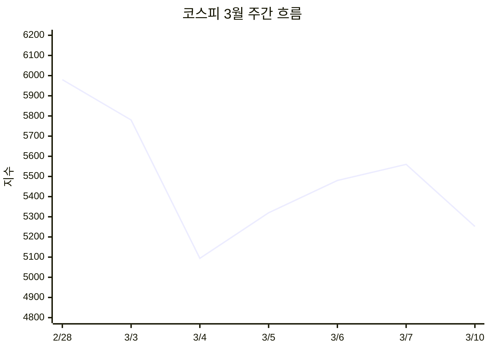

안녕하세요! 꿀벌 뉴스레터입니다. 3월 첫째 주 '검은 수요일' 이후 글로벌 증시가 서서히 균형을 찾아가고 있는데요. 트럼프 대통령의 "전쟁 곧 끝" 발언에 시장이 안도했지만, 이란은 "종전은 우리가 결정한다"며 맞서고 있죠. 오늘은 이 혼돈 속에서 기회를 찾는 전략을 함께 짚어보겠습니다.

---

🔎 **핵심콕콕**

- 코스피, 3월 4일 **-12.06%** 사상 최대 폭락 후 10일 **+5%** 반등하며 **5,500선** 회복
- 미국 S&P 500 **6,781**, 나스닥 **22,697**로 보합 마감 — 변동성 속 저점 매수세 유입
- WTI 유가 **$88** 수준으로 하락, G7 전략 비축유 방출 논의가 결정적
- 비트코인 **$71,278**(+3.3%), 금 **$5,236**(+2.6%) — 안전자산 동반 강세
- 오늘 미국 CPI 발표 예정, 인플레이션 경로가 핵심 변수

---

## 📊 시장 개요

3월 10일(월) 기준 주요 지수 현황입니다.

| 지표 | 현재값 | 전일 대비 | 비고 |
|------|--------|-----------|------|
| 코스피 | 5,252 | -5.96% | 3/10 종가 기준, 전주 폭락 영향 지속 |
| S&P 500 | 6,781 | -0.21% | 보합권 마감 |
| 나스닥 | 22,697 | +0.01% | 기술주 저점 매수세 |
| 다우존스 | 47,707 | -0.07% | 소폭 하락 |
| 원/달러 환율 | 1,470.80 | -24.70원 | 원화 강세 전환 |
| WTI 유가 | $88.07 | 하락세 | 고점($130) 대비 32% 하락 |
| 금(XAU) | $5,236 | +2.60% | 사상 최고치 경신 |
| 비트코인 | $71,278 | +3.29% | 안전자산 수요 |

> 📖 **서킷브레이커**: 주가가 급락할 때 시장의 패닉 매도를 방지하기 위해 거래를 일시 중단하는 제도. 코스피 8% 이상 하락 시 1단계 발동.

---

## 📈 기술적 분석

### 코스피

**지지/저항 구간**이 명확해졌습니다. 3월 4일 장중 저점 **5,093**이 강력한 지지선으로 작용하고 있고, **5,500~5,600** 구간이 1차 저항, **5,800~6,000**이 2차 저항으로 형성됐죠.

- **이동평균선**: 5일선이 20일선을 하향 돌파(데드크로스)한 상태. 단기 약세 신호이나, 반등 시 골든크로스 전환 가능성도 열려 있습니다.
- **거래량**: 3월 4일 폭락 당일 거래량이 연중 최고치를 기록했고, 이후 반등 과정에서도 높은 거래량을 유지 중. 기관·개인의 적극적 저점 매수세가 확인됩니다.

> 📖 **데드크로스**: 단기 이동평균선이 장기 이동평균선을 위에서 아래로 뚫는 것. 하락 추세 전환 신호로 해석.

### S&P 500

나스닥이 보합을 유지하며 **22,697**에서 마감했는데요. 기술주 중심의 저점 매수가 유입되면서 지수 방어에 성공했습니다. 다만 **6,700** 아래로 내려가면 추가 하락 가능성이 열리는 만큼, 이 구간이 핵심 지지선입니다.

---

## 🏢 종목 분석

### 1. 삼성전자 (005930)

| 항목 | 수치 |
|------|------|
| 현재가 | 188,200원 (3/7 기준) |
| PER | 14.2배 |
| PBR | 1.8배 |
| ROE | 12.7% |
| 목표주가 (키움) | 260,000원 |

3월 10일 **+8%** 급등하며 18만원대를 회복했습니다. 글로벌 메모리 반도체 수요 견조, HBM4 양산 기대감이 주가를 지지하고 있죠.

**AI 분석 의견**: 중동 리스크에도 반도체 슈퍼사이클 구조는 유효합니다. 낙폭과대 구간에서 분할 매수 전략이 유효하며, 단기 목표가 200,000원, 중기 260,000원 수준입니다.

### 2. SK하이닉스 (000660)

| 항목 | 수치 |
|------|------|
| 현재가 | 924,000원 |
| PER | 11.8배 |
| PBR | 3.2배 |
| ROE | 27.1% |
| 목표주가 (KB) | 1,200,000원 |

3월 10일 **+9%** 급등하며 91만원대 회복. HBM3E 공급 확대와 AI 데이터센터 투자 확대가 실적 모멘텀을 견인하고 있습니다.

**AI 분석 의견**: 2026년 영업이익 132조 원 전망. PER 기준 여전히 저평가 구간. 100만 원 돌파 시나리오가 유효합니다.

### 3. NVIDIA (NVDA)

| 항목 | 수치 |
|------|------|
| 현재가 | $182.75 |
| 시가총액 | $4.5T |

억만장자 투자자들이 시장 불안 속에서 NVIDIA를 대량 매수하고 있다는 보도가 나왔는데요. 테슬라 대주주인 론 바론이 "불안한 시장을 달래기 위해" NVIDIA를 추가 매수했다고 밝혔습니다.

**AI 분석 의견**: AI 인프라 투자 확대의 최대 수혜주. 중동 리스크와 무관한 구조적 성장 테마입니다.

### 4. 해운주 (HMM 등) — 주의 종목

해운주는 호르무즈 해협 봉쇄로 물동량이 급감하고, 유가 급등에 따른 연료비 부담이 커지면서 **약세**를 보이고 있습니다. 해상운임은 36년 만에 최고치이지만, 실제 물동량 감소로 수익성은 악화되는 역설적 상황이죠.

> 📖 **호르무즈 해협**: 페르시아만과 오만만을 잇는 해상 통로. 전 세계 석유 해상 운송량의 약 20%가 이곳을 통과하며, 봉쇄 시 글로벌 에너지 공급에 직격탄.

---

## 💰 자산별 동향

### 주식 섹터

| 섹터 | 동향 | 전망 |
|------|------|------|
| 반도체 | 🟢 강세 | 폭락 후 V자 반등, 슈퍼사이클 유효 |
| 방산 | 🟢 강세 | 중동 긴장 지속 수혜 |
| 조선 | 🟢 강세 | LNG 운반선 수요 증가 |
| 에너지 | 🟡 혼조 | 유가 하락 전환 시 조정 가능 |
| 해운 | 🔴 약세 | 물동량 감소 + 연료비 부담 |
| 항공/여행 | 🔴 약세 | 유가 부담 + 중동 노선 차질 |

### 크립토

비트코인이 **$71,278**로 3.3% 상승했습니다. 레이 달리오가 "비트코인 시장은 금에 비해 여전히 작다"고 언급하면서도, 디지털 안전자산으로서의 역할이 부각되고 있죠. 다만 $75,000 저항선 돌파 여부가 관건입니다.

### 원자재

- **금**: $5,236으로 사상 최고치 경신. 뱅크오브아메리카는 2026년 $5,000 목표를 이미 달성, 추가 상승 여력이 있다는 전망입니다.
- **은**: UBS 목표가 $58~60, 최고 $65까지 전망.
- **WTI**: $88로 하락했지만, 호르무즈 해협 정상화에 최소 4주 소요 전망. 완전 안정화까지 변동성 지속 예상입니다.

---

## 🏢 수급 동향

### 외국인

3월 첫째 주 하락장에서 외국인이 **26조 원** 규모 순매도를 단행했습니다. 특히 하루 만에 3.17조 원을 던지며 패닉 매도의 주역이 됐죠. 다만 10일에는 삼성전자·SK하이닉스 등 반도체주 중심으로 **매수 전환** 조짐이 나타났습니다.

### 기관

기관도 초기에는 매도세를 보였으나, 낙폭과대 인식 후 **저점 매수** 전략으로 전환하는 모습입니다.

### 개인(개미)

개인 투자자들이 **33조 원** 순매수로 시장 방어에 나섰습니다. "공포에 사라"는 역발상 투자가 다시 한번 나타난 셈이죠.

> 📖 **매수 사이드카**: 프로그램 매수 호가가 직전 가격 대비 6% 이상 상승하고 1분간 지속될 때 발동되는 제도. 3월 10일 코스피 급등 시 발동됨.

### ETF 동향

중동 리스크 관련 **에너지 ETF**, **방산 ETF**가 강세를 보이고 있으며, 반대로 **항공·여행 ETF**는 약세 지속 중입니다. 변동성 확대로 **인버스/레버리지 ETF** 거래량도 급증했습니다.

---

## 💡 매매 전략

### 단기 전략 (1~2주)

- **반도체주 분할 매수**: 삼성전자 180,000원 이하, SK하이닉스 900,000원 이하 구간은 단기 저점 매수 유효
- **유가 관련주 차익 실현**: WTI $85 이하 추가 하락 시 에너지주 비중 축소 검토
- **변동성 활용**: VIX 지수가 높은 구간에서 옵션 프리미엄 매도 전략도 고려 가능

### 중기 전략 (1~3개월)

- **반도체 슈퍼사이클** 테마는 중동 리스크와 무관하게 유지. HBM·AI 반도체 중심 포트폴리오 구축
- **방산·조선** 섹터는 지정학적 긴장 장기화 시 구조적 수혜. 비중 확대 검토
- **원화 강세 전환 시** 수출주 → 내수주 리밸런싱 고려

### 리스크 관리

- ⚠️ 호르무즈 해협 정상화 지연 시 유가 재급등 가능 — 포트폴리오의 에너지 익스포저 점검 필수
- ⚠️ 이란의 "전쟁 종결은 우리가 결정" 발언 — 트럼프 발언만 믿고 풀 베팅은 위험
- ⚠️ 오늘 미국 CPI 발표 — 예상 상회 시 금리 인하 기대 후퇴로 추가 조정 가능
- 현금 비중 **20~30%** 유지 권장. 확실한 바닥 확인 전까지 분할 매수 원칙

> 📖 **VIX 지수**: 시장의 공포 수준을 나타내는 변동성 지수. '공포 지수'라고도 불리며, 수치가 높을수록 시장 불안이 크다는 의미.

---

## 🗞️ 한줄뉴스

- G7, 전략 비축유 공동 방출 검토 — 유가 안정화 기대감 확산
- 호르무즈 해협 정상화까지 **최소 4주** 소요 전망 — 해운 물류 차질 장기화 우려
- 이란 "석유 수출 1리터도 허용 안 해" — 트럼프 '종전 임박'과 정면충돌
- 론 바론(테슬라 대주주), NVIDIA 대량 매수 — "불안한 시장 달래기 위해"
- 미국 경제 **'E자형'** 양극화 심화 — 고소득층 프리미엄 소비 vs 저소득층 부채 의존
- 오늘 미국 **CPI 발표** 예정 — 인플레이션 경로 재확인 변수

---

## 📅 이번주 일정

| 날짜 | 일정 | 중요도 |
|------|------|--------|
| 3/11 (화) | 🇺🇸 미국 2월 CPI 발표 | ⭐⭐⭐ |
| 3/11 (화) | 🇺🇸 미국 3년물 국채 경매 | ⭐⭐ |
| 3/12 (수) | 🇺🇸 미국 10년물 국채 경매 | ⭐⭐ |
| 3/12 (수) | 🇰🇷 한국은행 금융안정 상황 점검 회의 | ⭐⭐ |
| 3/13 (목) | 🇺🇸 미국 PPI 발표 | ⭐⭐ |
| 3/14 (금) | 🇺🇸 미시간대 소비자심리지수 | ⭐⭐ |

---

## 📎 출처

- [Stock Market Live - March 10, 2026: S&P 500 Down Even as Oil Sinks](https://247wallst.com/investing/2026/03/10/stock-market-live-march-10-2026-sp-500-spy-down-even-as-oil-sinks/) — 24/7 Wall St.
- [S&P 500 ends volatile day slightly lower as Iran conflict keeps traders on edge](https://www.cnbc.com/2026/03/09/stock-market-today-live-updates.html) — CNBC
- [2026년 3월 증시 대폭락과 기회: 유가 90불, 환율 1500원 시대의 투자 전략](https://jaebfactory.wordpress.com/2026/03/07/2026%EB%85%84-3%EC%9B%94-%EC%A6%9D%EC%8B%9C-%EB%8C%80%ED%8F%AD%EB%9D%BD%EA%B3%BC-%EA%B8%B0%ED%9A%8C%EC%9C%A0%EA%B0%80-90%EB%B6%88-%ED%99%98%EC%9C%A8-1500%EC%9B%90-%EC%8B%9C%EB%8C%80%EC%9D%98/) — Domaine de la Jaeb
- [중동 충격에 급락한 코스피…반등 가능성 주목](https://www.fnnews.com/news/202603081110168559) — 파이낸셜뉴스
- [트럼프 "이란 전쟁, 매우 빨리 끝날 것"](https://www.thepublic.kr/news/articleView.html?idxno=296873) — 더퍼블릭
- [이란, "전쟁 종료는 우리 결정… 석유 수출 막겠다"](https://www.etoday.co.kr/news/view/2563944) — 이투데이
- ['종전 임박' 트럼프 발언에 삼성전자 18만원선 회복](https://www.hankyung.com/article/2026031001786) — 한국경제
- [해상운임 36년 만에 최고치인데…해운주 주가 회항한 이유](https://www.hankyung.com/article/2026030990736) — 한국경제
- [Tesla Billionaire Buys More Nvidia to 'Calm the Nervous Market'](https://www.bloomberg.com/news/articles/2026-03-09/tesla-billionaire-buys-more-nvidia-to-calm-the-nervous-market) — Bloomberg
- [Current price of Bitcoin for March 10, 2026](https://fortune.com/article/price-of-bitcoin-03-10-2026/) — Fortune
- [코스피/역사/2026년](https://namu.wiki/w/%EC%BD%94%EC%8A%A4%ED%94%BC/%EC%97%AD%EC%82%AC/2026%EB%85%84) — 나무위키

---

> ⚠️ **면책 조항**: 본 뉴스레터는 정보 제공 목적으로 작성되었으며, 특정 금융 상품에 대한 투자 권유가 아닙니다. 투자 판단은 본인의 책임 하에 이루어져야 하며, 투자 전 전문가와 상담하시기 바랍니다.
