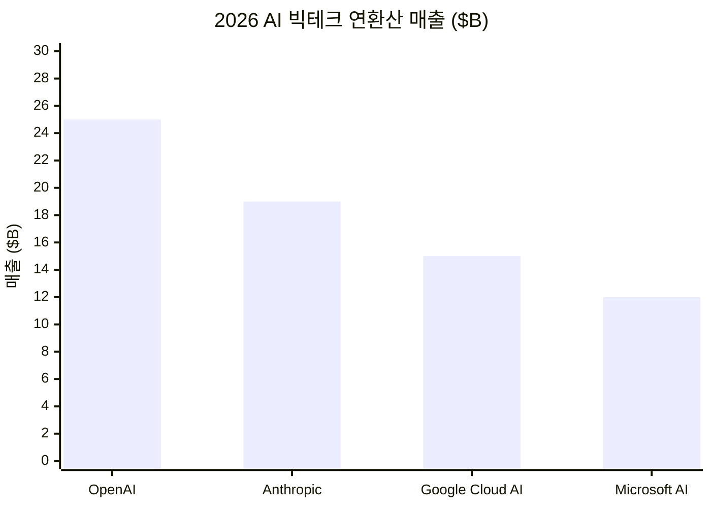
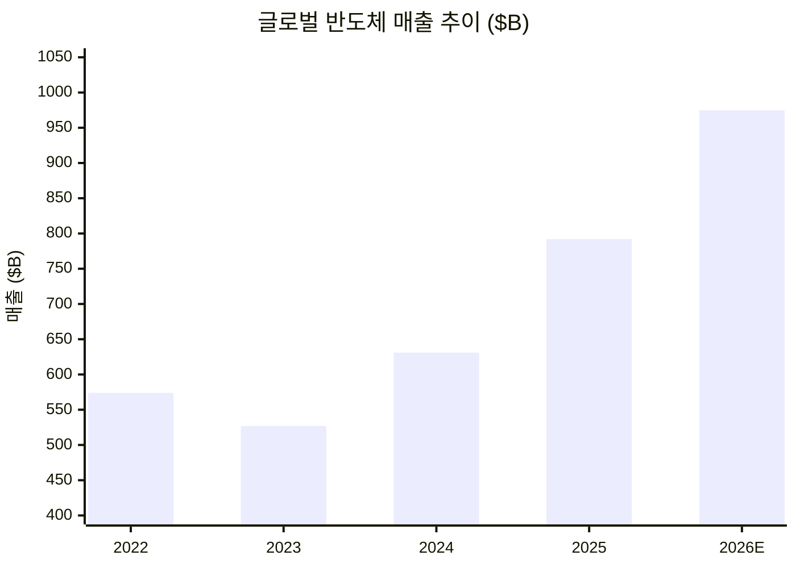

수집된 뉴스를 바탕으로 뉴스레터를 작성합니다.

---

# 🐝 꿀벌 뉴스레터 [테크]: Apple 50주년, AI 판도 재편의 봄 (2026-04-01)

오늘 Apple이 창립 50주년을 맞았다. 같은 주에 GPT-4o가 완전 퇴역하고, Apple은 Siri의 두뇌를 Google Gemini로 교체했다. Citrix 치명적 취약점이 야생에서 악용되는 가운데, 반도체 산업은 사상 첫 1조 달러 돌파를 눈앞에 두고 있다.

---

## 📌 오늘의 핵심 요약

| # | 토픽 | 한줄 요약 |
|---|------|----------|
| 1 | 🍎 Apple 50주년 | 1976년 창립 이후 반세기, Apple Park에서 Paul McCartney 피날레 공연 |
| 2 | 🤖 Apple × Google Gemini | Siri의 AI 엔진을 Gemini로 전면 교체, 연 10억 달러 규모 계약 |
| 3 | 🪦 GPT-4o 퇴역 | 4월 3일부로 모든 ChatGPT 플랜에서 GPT-4o 완전 종료 |
| 4 | 🔓 Citrix 제로데이 | CVE-2026-3055(CVSS 9.3), CISA KEV 등재 후 적극 악용 중 |
| 5 | 💎 반도체 1조 달러 | SIA 전망: 2026년 글로벌 반도체 매출 $975B, 사실상 1조 달러 |
| 6 | 📊 AI 빅테크 매출 경쟁 | OpenAI 연매출 $25B 돌파, Anthropic $19B 추격 |

---

## 1. 🍎 Apple 창립 50주년 — 반세기의 "Think Different"

**팩트** — 1976년 4월 1일 스티브 잡스, 스티브 워즈니악, 로널드 웨인이 설립한 Apple이 오늘 50주년을 맞았다. Apple Park에서 Paul McCartney 피날레 콘서트가 열리며, 전 세계 Apple Store에서 Alicia Keys(뉴욕), Mumford & Sons(런던) 등 기념 공연이 진행됐다. 직원들에게는 레인보우 로고 기념 티셔츠·에나멜 핀·한정판 포스터가 지급됐다.

**맥락** — Apple 홈페이지는 오리지널 Mac부터 iPhone 17 Pro, Vision Pro까지 아이코닉 제품들을 스케치 애니메이션으로 보여주는 특별 페이지로 교체됐다. 단순한 축하가 아니라, AI 시대 Apple의 방향성을 재확인하는 브랜딩 이벤트다.

**영향** — Apple은 50주년을 기점으로 Gemini 기반 Apple Intelligence를 본격 전개하며, AI-디바이스 통합 전략의 다음 장을 열겠다는 시그널을 보내고 있다.

**전망** — **WWDC 2026에서 Gemini 통합 Siri 정식 발표** → Apple Intelligence 2.0 시대 개막. **AI 전략이 지지부진할 경우** → 50주년이 "과거 회상"에 그칠 리스크.

> 💡 **한 줄 인사이트**: 50년의 무게는 혁신의 역사가 아니라, 다음 50년을 어떻게 설계하느냐에 달렸다.
> 🔗 [Apple Newsroom](https://www.apple.com/newsroom/2026/03/apple-to-celebrate-50-years-of-thinking-different/) · [9to5Mac](https://9to5mac.com/2026/04/01/apple-50-birthday-homepage-celebration/) · [MacRumors](https://www.macrumors.com/2026/03/29/apples-50th-anniversary-finale-revealed/)

---

## 2. 🤖 Apple, Siri 두뇌를 Google Gemini로 교체

**팩트** — Apple과 Google는 다년간 협력 계약을 체결, 차세대 Apple Foundation Models를 Google Gemini 모델 및 클라우드 기술 기반으로 구축한다. Apple은 연간 약 10억 달러를 Google에 지불하며, Gemini 모델에 대한 완전 접근 권한을 확보해 자체 데이터센터에서 소형 모델을 파생 제작할 수 있다.

**맥락** — 이전까지 Apple Intelligence의 외부 LLM 파트너는 OpenAI였다. 이번 전환으로 OpenAI는 20억 대 이상의 Apple 디바이스 기본 탑재 지위를 잃게 됐다. Apple은 개인 맥락 이해, 화면 인식, 앱별 심층 제어 등 차세대 Siri 기능을 시연했다.

**영향** — Google은 검색 독점에 이어 AI 모델 공급 측면에서도 Apple 생태계를 장악하게 된다. OpenAI에게는 B2C 채널 축소라는 직격탄.

**전망** — **Gemini-Siri 통합이 매끄러울 경우** → Google의 AI 유통 지배력 확고. **개인정보 이슈 부각 시** → Apple의 "프라이버시 우선" 브랜딩과 충돌 가능.

> 💡 **한 줄 인사이트**: AI 시대의 "기본 검색엔진 계약"이 "기본 LLM 계약"으로 진화했다.
> 🔗 [Google-Apple 공동성명](https://blog.google/company-news/inside-google/company-announcements/joint-statement-google-apple/) · [CNBC](https://www.cnbc.com/2026/01/12/apple-google-ai-siri-gemini.html) · [TechCrunch](https://techcrunch.com/2026/01/12/googles-gemini-to-power-apples-ai-features-like-siri/)

---

## 3. 🪦 GPT-4o, 4월 3일부로 완전 퇴역

**팩트** — OpenAI는 2월 13일 ChatGPT에서 GPT-4o를 일반 사용자 대상으로 중단했으며, Business·Enterprise·Edu 고객의 Custom GPTs 접근도 4월 3일자로 종료된다. 이후 GPT-4o는 API에서만 유지되며, ChatGPT UI에서는 완전히 사라진다.

**맥락** — GPT-5.2로의 이전이 빠르게 진행되어 일일 활성 사용자 중 GPT-4o 선택 비율은 0.1%까지 하락했다. 그러나 AI 컴패니언 사용자 커뮤니티에서는 "인격 소멸"에 대한 반발이 거셌고, TechCrunch는 이를 "AI 동반자의 위험성"으로 분석했다.

**영향** — 기업 고객은 이번 주 내로 Custom GPTs를 GPT-5 계열로 마이그레이션해야 한다. API 의존 개발자들도 장기적으로 마이그레이션 계획이 필요하다.

**전망** — **GPT-5.2 성능이 충분할 경우** → 자연스러운 세대교체 완료. **특정 워크로드에서 회귀 발생 시** → API에서의 GPT-4o 수명 연장 가능성.

> 💡 **한 줄 인사이트**: AI 모델의 수명주기가 18개월로 단축됐다 — 기술 부채 관리가 새로운 핵심 역량이다.
> 🔗 [OpenAI 공식](https://openai.com/index/retiring-gpt-4o-and-older-models/) · [CNBC](https://www.cnbc.com/2026/01/29/openai-will-retire-gpt-4o-from-chatgpt-next-month.html) · [TechCrunch](https://techcrunch.com/2026/02/06/the-backlash-over-openais-decision-to-retire-gpt-4o-shows-how-dangerous-ai-companions-can-be/)

---

## 4. 🔓 Citrix NetScaler 치명적 취약점, 야생에서 악용 중

**팩트** — CVE-2026-3055(CVSS 9.3)이 3월 30일 CISA KEV(알려진 악용 취약점) 목록에 등재됐다. NetScaler ADC/Gateway의 입력 검증 부족으로 인한 메모리 오버리드 취약점으로, 공격자가 조작된 SAMLRequest를 `/saml/login`에 전송하면 세션 토큰 등 민감 정보가 유출된다.

**맥락** — SAML IdP로 구성된 시스템만 영향을 받으며, 기본 설정은 안전하다. 영향 받는 버전은 14.1-66.59 이전, 13.1-62.23 이전. 패치는 이미 배포됐으나, 실제 악용이 확인된 상태라 긴급 업그레이드가 필요하다.

**영향** — Citrix NetScaler는 글로벌 기업 네트워크의 핵심 게이트웨이 장비다. 세션 토큰 탈취는 곧 VPN 세션 하이재킹과 내부 네트워크 침투를 의미한다.

**전망** — **패치 적용이 빠를 경우** → 피해 최소화. **패치 지연 시** → 대규모 공급망 침해 사고로 확대 가능.

> 💡 **한 줄 인사이트**: CVSS 9.3 + CISA KEV + 야생 악용 — 이 세 박자가 맞으면 "지금 당장 패치"가 유일한 답이다.
> 🔗 [The Hacker News](https://thehackernews.com/2026/03/citrix-netscaler-under-active-recon-for.html) · [Rapid7](https://www.rapid7.com/blog/post/etr-cve-2026-3055-citrix-netscaler-adc-and-netscaler-gateway-out-of-bounds-read/) · [CISA](https://cybersecuritynews.com/citrix-netscaler-vulnerability-exploited/)

---

## 5. 💎 반도체 산업, 사상 첫 1조 달러 시대 개막

**팩트** — SIA(미국반도체산업협회)에 따르면 2025년 글로벌 반도체 매출은 $791.7B(전년비 +25.6%)을 기록했으며, 2026년 전망치는 $975.4B으로 사실상 1조 달러 돌파가 확실시된다. 로직 제품 +39.9%($301.9B), 메모리 +34.8%($223.1B)가 성장을 견인했다.

**맥락** — AI 칩이 전체 매출의 약 절반을 차지하지만, 물량 기준으로는 전체의 0.2% 미만이다. 즉, 소수의 고가 AI 칩이 산업 전체의 매출 구조를 바꾸고 있다. 한편 중동 지정학 리스크로 SK하이닉스·삼성의 시총이 $200B 이상 증발했다.

**영향** — NVIDIA가 TSMC CoWoS 패키징 용량의 절반 이상을 2027년까지 확보했고, Google은 TPU 생산 목표를 400만→300만으로 하향 조정해야 했다. 선단 패키징 병목이 AI 칩 경쟁의 실질적 제약 요인이다.

**전망** — **AI 수요가 유지될 경우** → 2026년 내 $1T 달성 확정적. **중동 리스크 확대 시** → 에너지 비용·소재 접근성 악화로 성장률 둔화.

> 💡 **한 줄 인사이트**: 1조 달러의 절반이 0.2%의 AI 칩에서 나온다 — 반도체 산업의 "AI 편중"이 곧 리스크다.
> 🔗 [SIA](https://www.semiconductors.org/global-annual-semiconductor-sales-increase-25-6-to-791-7-billion-in-2025/) · [Tom's Hardware](https://www.tomshardware.com/tech-industry/semiconductors/semiconductor-industry-on-track-to-hit-usd1-trillion-in-sales-in-2026-sia-predicts-bumper-forecast-follows-usd791-7-billion-haul-for-2025) · [Deloitte](https://www.deloitte.com/us/en/insights/industry/technology/technology-media-telecom-outlooks/semiconductor-industry-outlook.html)

---

## 6. 📊 AI 빅테크 매출 전쟁 — OpenAI $25B vs Anthropic $19B

**팩트** — OpenAI의 연환산 매출이 $25B을 돌파했으며, ChatGPT 주간 활성 사용자는 8억 명, 기업 고객은 100만 개를 넘었다. Anthropic도 $19B에 근접하며 빠르게 추격 중이다. OpenAI는 2026년 말 IPO를 검토 중인 것으로 알려졌다.

**맥락** — OpenAI는 2026년 ChatGPT를 단순 챗봇에서 개인 맥락을 이해하는 "슈퍼 어시스턴트"로 진화시키겠다는 전략을 밝혔다. 한편, AI 업계 전반에서 "모델이 아닌 사용자가 병목"이라는 새로운 내러티브가 형성되고 있다.

**영향** — AI 기업들의 수익성이 입증되면서, 2026년은 "하이프에서 실용주의로" 전환하는 해로 규정되고 있다. Google Gemini 3.1 Flash-Lite($0.25/M 토큰)처럼 효율 모델 경쟁도 격화 중이다.

**전망** — **OpenAI IPO 성사 시** → AI 산업 역사상 최대 규모 상장. **수익성 증명 실패 시** → AI 버블 우려 재점화.

> 💡 **한 줄 인사이트**: 매출이 곧 모델 성능의 증거다 — 돈을 내는 사용자가 있다는 것은 실질적 가치가 있다는 뜻이다.
> 🔗 [Crescendo AI News](https://www.crescendo.ai/news/latest-ai-news-and-updates) · [The Decoder](https://the-decoder.com/ai-industry-finds-its-2026-narrative-as-openai-and-microsoft-argue-users-are-the-bottleneck-not-models/) · [TechCrunch](https://techcrunch.com/2026/01/02/in-2026-ai-will-move-from-hype-to-pragmatism/)

---

## 📊 주요 지표 비교

---

## 🎯 오늘의 핵심 시그널

> 이 세 가지를 기억하라.

1. **[AI 유통 재편]**: Apple-Google Gemini 동맹으로 AI 모델의 디바이스 유통 구조가 근본적으로 바뀌고 있다. "누가 만드느냐"보다 "누가 깔아주느냐"가 승부를 가른다.
2. **[모델 수명주기 단축]**: GPT-4o의 18개월 퇴역은 AI 인프라의 감가상각 주기가 전통 소프트웨어와 완전히 다르다는 것을 보여준다. 마이그레이션 전략이 필수다.
3. **[패키징 병목]**: 반도체 1조 달러 시대의 진짜 제약은 칩 설계가 아니라 CoWoS 같은 선단 패키징 용량이다. NVIDIA의 용량 선점이 경쟁 구도를 결정한다.

## 📌 다음 주 주목할 변수

- **4월 3일**: GPT-4o Enterprise/Edu Custom GPTs 완전 종료 — 마이그레이션 미완료 기업 혼란 가능
- **Apple WWDC 2026 프리뷰**: Gemini 기반 Siri 시연 범위와 프라이버시 프레임워크 공개 여부
- **CVE-2026-3055 후속**: 패치 미적용 NetScaler 대상 2차 공격 캠페인 가능성
- **중동 정세**: SK하이닉스·삼성 메모리 수급 및 에너지 비용 영향 모니터링

## 📎 출처

- [Apple 50주년 공식 발표](https://www.apple.com/newsroom/2026/03/apple-to-celebrate-50-years-of-thinking-different/)
- [Apple 50주년 홈페이지 - 9to5Mac](https://9to5mac.com/2026/04/01/apple-50-birthday-homepage-celebration/)
- [Apple-Google 공동성명](https://blog.google/company-news/inside-google/company-announcements/joint-statement-google-apple/)
- [Apple-Google Gemini Siri - CNBC](https://www.cnbc.com/2026/01/12/apple-google-ai-siri-gemini.html)
- [GPT-4o 퇴역 - OpenAI](https://openai.com/index/retiring-gpt-4o-and-older-models/)
- [GPT-4o 반발 - TechCrunch](https://techcrunch.com/2026/02/06/the-backlash-over-openais-decision-to-retire-gpt-4o-shows-how-dangerous-ai-companions-can-be/)
- [CVE-2026-3055 - The Hacker News](https://thehackernews.com/2026/03/citrix-netscaler-under-active-recon-for.html)
- [CVE-2026-3055 - Rapid7](https://www.rapid7.com/blog/post/etr-cve-2026-3055-citrix-netscaler-adc-and-netscaler-gateway-out-of-bounds-read/)
- [반도체 1조 달러 - SIA](https://www.semiconductors.org/global-annual-semiconductor-sales-increase-25-6-to-791-7-billion-in-2025/)
- [반도체 전망 - Tom's Hardware](https://www.tomshardware.com/tech-industry/semiconductors/semiconductor-industry-on-track-to-hit-usd1-trillion-in-sales-in-2026-sia-predicts-bumper-forecast-follows-usd791-7-billion-haul-for-2025)
- [AI 매출 동향 - Crescendo AI](https://www.crescendo.ai/news/latest-ai-news-and-updates)
- [AI 실용주의 전환 - TechCrunch](https://techcrunch.com/2026/01/02/in-2026-ai-will-move-from-hype-to-pragmatism/)
- [중동 반도체 영향 - CNBC](https://www.cnbc.com/2026/03/10/iran-war-semiconductor-memory-chip-impact.html)