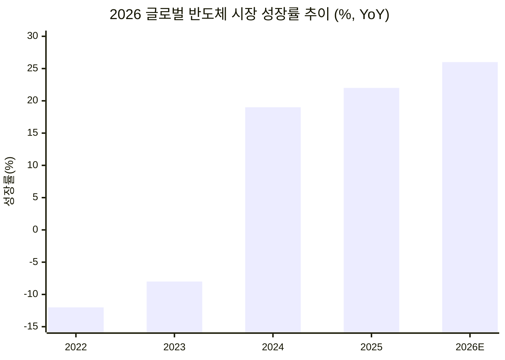

만우절이지만, 오늘의 뉴스는 농담이 아니다. 이란이 미국 빅테크 18곳에 공격을 예고했고, ChatGPT는 자동차 대시보드까지 침투했다. 반도체 시장은 1조 달러를 눈앞에 두고 있지만, 지정학 리스크가 발목을 잡는다.

---

## 📌 오늘의 핵심 요약

| # | 토픽 | 한줄 요약 |
|---|------|----------|
| 1 | 🚨 이란 빅테크 위협 | IRGC, Apple·Google·MS·Nvidia 등 18개사 중동 시설 공격 예고 |
| 2 | 🚗 ChatGPT × CarPlay | OpenAI, iOS 26.4 통해 CarPlay 전용 음성 AI 앱 출시 |
| 3 | 💎 반도체 $975B | 글로벌 칩 매출 전년비 26% 성장 전망, AI가 견인 |
| 4 | 💡 삼성 실리콘 포토닉스 | 전기 대신 빛으로 데이터 전송, 2028년 양산 목표 |
| 5 | 🧠 구글 터보퀀트 | AI 메모리 사용량 최대 6배 절감하는 압축 알고리즘 발표 |
| 6 | 🛡️ AI 보안 위협 심화 | AI Agent 악용 공격 급증, RaaS 4중 갈취 방식 진화 |

---

## 1. 🚨 이란 IRGC, 빅테크 18개사 중동 시설 공격 위협

**팩트** — 이란 혁명수비대(IRGC)가 4월 1일 오후 8시(테헤란 시각)부터 Apple, Google, Microsoft, Nvidia, Tesla 등 미국·걸프 기술기업 18곳의 중동 시설에 대한 공격을 예고했다.

**맥락** — 이란은 미국·이스라엘 정보기관이 AI, 클라우드 컴퓨팅, 감시 기술을 활용해 이란 고위 지휘관을 식별·암살했다고 반복 비난해왔다. 이란 국영 매체는 해당 기업들을 "테러리스트 스파이 기업"이라 지칭하며 공격을 정당화하고 있다.

**영향** — 중동에 데이터센터·지사를 운영 중인 빅테크 기업들의 물리적 보안 비용 급증이 불가피하다. 클라우드 서비스 지역 가용성에도 영향을 줄 수 있다.

**전망** — **위협이 실행될 경우** → 중동 리전 클라우드 서비스 중단, 글로벌 공급망 교란, 사이버 보복전 확대. **외교적 해결 시** → 빅테크의 중동 인프라 분산 투자 가속화, 보안 비용은 구조적으로 상승.

> 💡 **한 줄 인사이트**: 기술 기업이 지정학적 전쟁의 직접적 타깃이 되는 시대가 열렸다. 클라우드 인프라의 지리적 리스크 관리가 선택이 아닌 필수다.
> 🔗 [India TV News](https://www.indiatvnews.com/news/world/iran-threatens-attack-against-microsoft-apple-and-alphabet-from-april-1-2026-03-31-1035805) · [Defence Security Asia](https://defencesecurityasia.com/en/irgc-threatens-apple-google-microsoft-tesla-gulf-tech-infrastructure-april-2026/)

---

## 2. 🚗 ChatGPT, Apple CarPlay 진출 — AI 음성 비서 차량 전쟁 시작

**팩트** — OpenAI가 iOS 26.4 업데이트와 함께 ChatGPT의 Apple CarPlay 전용 앱을 출시했다. 주요 AI 앱 중 CarPlay 전용 앱을 선보인 것은 ChatGPT가 최초다.

**맥락** — CarPlay 버전은 완전한 음성 전용(voice-only) 인터페이스로, 화면에 텍스트 응답을 표시하지 않는다. Apple의 운전 중 주의분산 방지 정책을 따른 것이다. 웨이크 워드는 없어 앱을 수동으로 열어야 하며, Siri처럼 차량 제어나 iPhone 기능 연동은 불가능하다.

**영향** — 자동차 AI 비서 시장에서 선점 효과가 크다. Google, Anthropic 등 경쟁사의 차량용 AI 앱 출시가 가속화될 것으로 예상된다.

**전망** — **차량 OEM 파트너십 확대 시** → CarPlay를 넘어 차량 OS 레벨 통합으로 진화, 네비게이션·차량 진단과 결합. **Siri와 경쟁 심화 시** → Apple이 CarPlay 내 서드파티 AI 접근을 제한할 가능성도 존재.

> 💡 **한 줄 인사이트**: AI의 전장은 데스크톱 → 모바일 → 차량으로 확장 중이다. "차 안에서 어떤 AI를 쓰느냐"가 다음 플랫폼 전쟁의 핵심이 된다.
> 🔗 [MacRumors](https://www.macrumors.com/2026/03/31/openai-chatgpt-carplay/) · [9to5Mac](https://9to5mac.com/2026/03/31/chatgpt-app-launches-for-carplay-on-ios-26-4/) · [AppleInsider](https://appleinsider.com/articles/26/03/31/openais-chatgpt-now-available-hands-free-via-carplay-with-ios-264)

---

## 3. 💎 글로벌 반도체 매출 $975B 전망 — AI가 끌고, 지정학이 흔든다

**팩트** — 2026년 글로벌 칩 매출이 $975B(약 1,365조 원)에 달할 전망이다. 전년 대비 성장률이 22%에서 26%로 가속되고 있으며, AI 칩 수요가 핵심 동력이다.

**맥락** — 미국 정부는 NVIDIA H200, AMD MI325X 등 첨단 AI칩에 25% 관세를 부과했다. Google은 TSMC의 CoWoS 패키징 물량 부족으로 2026년 TPU 생산 목표를 400만→300만 대로 하향 조정했다. "실리콘 철의 장막"이라 불리는 진영 분리가 심화되고 있다.

**영향** — AI 인프라 투자를 주도하는 빅테크와 규제·관세 사이의 긴장이 고조된다. 패키징 병목이 AI 칩 공급의 실질적 제약 요인으로 부상했다.

**전망** — **AI 투자 지속 시** → 2027년 $1T 돌파 가능, 패키징·소재 기업이 최대 수혜. **관세·지정학 악화 시** → 공급망 이중화 비용 증가, 최종 제품 가격 상승 불가피.

> 💡 **한 줄 인사이트**: 반도체 경쟁의 병목은 더 이상 설계나 제조가 아니라 "패키징"이다. CoWoS를 쥔 자가 AI 칩 공급을 지배한다.
> 🔗 [Deloitte](https://www.deloitte.com/us/en/insights/industry/technology/technology-media-telecom-outlooks/semiconductor-industry-outlook.html) · [CNBC](https://www.cnbc.com/2026/03/10/iran-war-semiconductor-memory-chip-impact.html) · [Sourceability](https://sourceability.com/post/semiconductor-industry-outlook-for-2026-shows-rebound-amid-mergers)

---

## 4. 💡 삼성전자, 실리콘 포토닉스 2028년 양산 — 빛으로 데이터를 쏜다

**팩트** — 삼성전자가 전기 신호 대신 빛(광신호)으로 데이터를 전송하는 실리콘 포토닉스 기술을 2028년부터 양산할 계획이다.

**맥락** — AI 반도체의 성능이 높아질수록 칩 간 데이터 이동 속도(인터커넥트)가 병목이 된다. 전기 배선은 발열과 대역폭 한계가 있지만, 광전송은 이 두 문제를 동시에 해결한다. TSMC, 인텔도 유사 기술을 개발 중이나 삼성이 양산 시점을 구체적으로 명시한 것은 처음이다.

**영향** — HBM(고대역폭메모리) 다음의 반도체 기술 키워드가 "실리콘 포토닉스"로 이동할 가능성이 높다. 관련 장비·소재 기업에 대한 시장 관심이 높아질 전망이다.

**전망** — **양산 성공 시** → AI 데이터센터의 전력 효율이 획기적으로 개선, 삼성 파운드리의 경쟁력 재평가. **기술 지연 시** → TSMC·인텔에 선점 기회를 내줄 수 있음.

> 💡 **한 줄 인사이트**: AI 반도체의 다음 전쟁터는 "칩 안에서 빛을 어떻게 다루느냐"다. 실리콘 포토닉스는 무어의 법칙 이후의 성능 향상 열쇠다.
> 🔗 [SPTA Times Korea](https://www.sptatimeskorea.com/post/%EC%A0%9C20260329-tt-01%ED%98%B8-2026%EB%85%84-3%EC%9B%94-29%EC%9D%BC-%EB%B0%98%EB%8F%84%EC%B2%B4-%EA%B8%B0%EC%88%A0-%EA%B4%80%EB%A0%A8-%EC%A3%BC%EC%9A%94-%EB%89%B4%EC%8A%A4-%EC%9A%94%EC%95%BD)

---

## 5. 🧠 구글 '터보퀀트' — AI 메모리 사용량 6배 절감

**팩트** — 구글이 AI 연산 과정에서 메모리 사용량을 최대 6배 줄이는 압축 알고리즘 '터보퀀트(TurboQuant)'를 발표했다.

**맥락** — LLM의 파라미터 수가 수조 단위로 확대되면서 추론 비용과 메모리 소비가 기업들의 AI 도입 최대 장벽으로 부상했다. 터보퀀트는 모델 정확도를 유지하면서도 양자화(quantization) 효율을 극대화하는 기술로, 온디바이스 AI와 엣지 컴퓨팅에 직접적 영향을 미친다.

**영향** — 고사양 GPU 없이도 대규모 모델 실행이 가능해지면서 AI 민주화가 한 단계 앞당겨진다. 클라우드 추론 비용 절감으로 SaaS 기업의 AI 기능 탑재 속도가 빨라질 전망이다.

**전망** — **업계 표준화 시** → 소형 디바이스에서도 GPT급 모델 구동 가능, 엣지 AI 생태계 폭발적 성장. **경쟁사 대응 시** → Meta, OpenAI도 유사 압축 기술 경쟁 돌입, 추론 비용 가격 전쟁 심화.

> 💡 **한 줄 인사이트**: AI 전쟁의 다음 승부처는 "모델을 얼마나 작고 빠르게 돌리느냐"다. 파라미터 경쟁에서 효율 경쟁으로 축이 이동한다.
> 🔗 [SPTA Times Korea](https://www.sptatimeskorea.com/post/%EC%A0%9C-20260329-ai-01%ED%98%B8-2026%EB%85%84-3%EC%9B%94-4%EC%A3%BC%EC%B0%A8-%EA%B8%80%EB%A1%9C%EB%B2%8C-%EB%B0%98%EB%8F%84%EC%B2%B4%EC%82%B0%EC%97%85-%EA%B4%80%EB%A0%A8-%EA%B8%B0%EC%82%AC-%EB%B6%84%EC%84%9D)

---

## 6. 🛡️ AI 기반 사이버 위협 심화 — 공격자도 에이전트를 쓴다

**팩트** — 2026년 들어 AI Agent를 악용한 사이버 공격이 급증하고 있다. 랜섬웨어는 RaaS(Ransomware as a Service)를 넘어 4중 갈취(암호화 + 유출 협박 + DDoS + 고객 직접 협박) 방식으로 진화했다.

**맥락** — AI Agent의 과도한 권한 위임이 새로운 공격 벡터로 부상했다. 자동화된 AI 에이전트가 내부 시스템에 접근하면서 데이터 유출·시스템 침해 경로가 다양해졌다. 오픈소스 공급망 공격도 여전히 심각하며, 제3자 서비스 업체를 노린 공급망 전반 침해가 확대되고 있다.

**영향** — 기업의 AI 도입과 동시에 AI 거버넌스·접근제어 체계 구축이 필수가 되었다. 보안 솔루션 시장은 AI 네이티브 보안으로 빠르게 재편 중이다.

**전망** — **AI 보안 투자 확대 시** → AI로 공격을 탐지·차단하는 "AI vs AI" 보안 구도 정착. **거버넌스 미비 시** → AI Agent 권한 남용으로 인한 대형 사고 발생 가능성 증가.

> 💡 **한 줄 인사이트**: AI를 도입하는 기업은 반드시 "AI가 뚫리면 어떻게 되는가"를 먼저 설계해야 한다. 보안은 기능이 아니라 아키텍처다.
> 🔗 [삼성SDS](https://www.samsungsds.com/kr/insights/cybersecurity-threats-and-response-2026.html) · [이글루코퍼레이션](https://www.igloo.co.kr/security-information/%EB%B3%B4%EC%95%88-101-2026%EB%85%84-%EC%82%AC%EC%9D%B4%EB%B2%84-%EB%B3%B4%EC%95%88-%EC%9C%84%ED%98%91-%EB%B0%8F-%EA%B8%B0%EC%88%A0-%EC%A0%84%EB%A7%9D/) · [Google Cloud](https://cloud.google.com/resources/intl/ko-kr/cybersecurity-forecast?hl=ko)

---

## 📊 주요 지표 비교

---

## 🎯 오늘의 핵심 시그널

> 이 세 가지를 기억하라.

1. **[지정학 = 기술 리스크]**: 이란의 빅테크 시설 공격 위협은 기술 인프라가 군사적 타깃이 되는 새로운 패러다임을 보여준다. 클라우드 리전 분산 전략이 보안 이슈에서 생존 이슈로 격상되었다.
2. **[AI의 물리적 확장]**: ChatGPT의 CarPlay 진출은 AI가 스크린을 벗어나 자동차·가전·웨어러블 등 물리적 공간으로 스며드는 시작점이다. 다음 플랫폼 전쟁은 "어디서 AI를 쓰느냐"다.
3. **[효율이 곧 경쟁력]**: 구글 터보퀀트(메모리 6배 절감), 삼성 실리콘 포토닉스(광전송) — AI 산업의 경쟁축이 "더 크게"에서 "더 효율적으로"로 완전히 전환됐다.

## 📌 다음 주 주목할 변수

- **이란 위협 실행 여부**: 4월 1일 이후 중동 빅테크 인프라의 실제 피해 발생 여부와 국제사회 대응
- **TSMC 2026 Q1 실적 발표**: AI 칩 수주 현황과 CoWoS 패키징 증설 계획 공개 예상
- **Apple WWDC 2026 사전 루머**: iOS 27의 AI 통합 전략, Siri vs ChatGPT 구도 변화 단서

## 📎 출처

- [MacRumors - ChatGPT CarPlay](https://www.macrumors.com/2026/03/31/openai-chatgpt-carplay/)
- [9to5Mac - ChatGPT CarPlay](https://9to5mac.com/2026/03/31/chatgpt-app-launches-for-carplay-on-ios-26-4/)
- [AppleInsider - ChatGPT CarPlay](https://appleinsider.com/articles/26/03/31/openais-chatgpt-now-available-hands-free-via-carplay-with-ios-264)
- [India TV News - 이란 빅테크 위협](https://www.indiatvnews.com/news/world/iran-threatens-attack-against-microsoft-apple-and-alphabet-from-april-1-2026-03-31-1035805)
- [Defence Security Asia - IRGC 위협](https://defencesecurityasia.com/en/irgc-threatens-apple-google-microsoft-tesla-gulf-tech-infrastructure-april-2026/)
- [Deloitte - 반도체 시장 전망](https://www.deloitte.com/us/en/insights/industry/technology/technology-media-telecom-outlooks/semiconductor-industry-outlook.html)
- [CNBC - 이란 전쟁과 반도체](https://www.cnbc.com/2026/03/10/iran-war-semiconductor-memory-chip-impact.html)
- [SPTA Times Korea - 반도체 기술 뉴스](https://www.sptatimeskorea.com/post/%EC%A0%9C20260329-tt-01%ED%98%B8-2026%EB%85%84-3%EC%9B%94-29%EC%9D%BC-%EB%B0%98%EB%8F%84%EC%B2%B4-%EA%B8%B0%EC%88%A0-%EA%B4%80%EB%A0%A8-%EC%A3%BC%EC%9A%94-%EB%89%B4%EC%8A%A4-%EC%9A%94%EC%95%BD)
- [SPTA Times Korea - 글로벌 반도체 분석](https://www.sptatimeskorea.com/post/%EC%A0%9C-20260329-ai-01%ED%98%B8-2026%EB%85%84-3%EC%9B%94-4%EC%A3%BC%EC%B0%A8-%EA%B8%80%EB%A1%9C%EB%B2%8C-%EB%B0%98%EB%8F%84%EC%B2%B4%EC%82%B0%EC%97%85-%EA%B4%80%EB%A0%A8-%EA%B8%B0%EC%82%AC-%EB%B6%84%EC%84%9D)
- [삼성SDS - 2026 사이버보안 위협](https://www.samsungsds.com/kr/insights/cybersecurity-threats-and-response-2026.html)
- [이글루코퍼레이션 - 2026 보안 전망](https://www.igloo.co.kr/security-information/%EB%B3%B4%EC%95%88-101-2026%EB%85%84-%EC%82%AC%EC%9D%B4%EB%B2%84-%EB%B3%B4%EC%95%88-%EC%9C%84%ED%98%91-%EB%B0%8F-%EA%B8%B0%EC%88%A0-%EC%A0%84%EB%A7%9D/)
- [Google Cloud - 사이버보안 전망](https://cloud.google.com/resources/intl/ko-kr/cybersecurity-forecast?hl=ko)