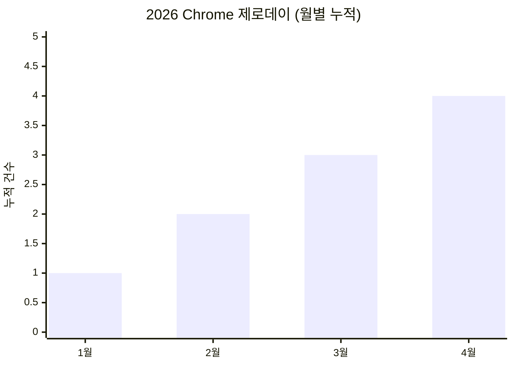

**Chrome WebGPU 제로데이가 올해만 네 번째다.** AI 파이프라인 도구 Langflow는 공개 20시간 만에 실전 익스플로잇이 터졌고, MS 3월 패치튜즈데이는 82개 취약점을 한꺼번에 닫았다. 랜섬웨어 그룹은 71분마다 새 피해자를 올리고 있으며, EU NIS2는 본격 단속 모드에 진입했다. 방어선 점검이 필요한 한 주다.

---

## 📌 오늘의 핵심 요약

| # | 토픽 | 한줄 요약 |
|---|------|----------|
| 1 | 🔴 Chrome 제로데이 | CVE-2026-5281: Dawn WebGPU UAF, 올해 네 번째 야생 익스플로잇 |
| 2 | 🔴 Langflow RCE | CVE-2026-33017(CVSS 9.3): 공개 20시간 만에 공격 시작, 인증 불필요 |
| 3 | 🟠 MS 패치튜즈데이 | 82개 CVE 수정, SQL Server 권한상승·Office RCE 포함 |
| 4 | 💀 랜섬웨어 동향 | 71분마다 1건 피해 공개, Brightspeed 100만 고객 유출 |
| 5 | 🛡️ 보안 도구 신규 | BlacksmithAI·Betterleaks·VulHunt CE 등 오픈소스 러시 |
| 6 | ⚖️ NIS2 단속 개시 | EU 회원국 전환 마무리, 능동 감독·집행 본격화 |

---

## 🔎 위협 인텔리전스

### 1. 🔴 Chrome 제로데이 CVE-2026-5281 — WebGPU가 해커의 놀이터가 되다

**CVE:** CVE-2026-5281  
**CVSS:** High (Google 자체 심각도)  
**유형:** Use-After-Free (CWE-416)

**팩트** — Google이 4월 1일 Chrome 긴급 패치를 배포했다. Dawn(WebGPU 구현체)의 UAF 버그로, 야생에서 활발히 악용 중이다. 올해만 네 번째 Chrome 제로데이다.

**공격 벡터** — 렌더러 프로세스를 먼저 장악한 뒤, 이 Dawn 결함으로 샌드박스 탈출을 시도하는 **익스플로잇 체인** 구조다. 조작된 HTML 페이지 방문만으로 임의 코드 실행이 가능하다.

**영향** — Chrome 146.0.7680.177 미만 전 플랫폼(Windows/Mac/Linux). Chromium 기반 브라우저(Edge, Brave, Opera 등)도 영향권이다.

**대응**
- Chrome 즉시 업데이트: `146.0.7680.177/178` 이상
- Chromium 파생 브라우저도 동일 버전 확인
- WebGPU 미사용 환경이면 `chrome://flags/#enable-unsafe-webgpu` 비활성화 고려
- 엔터프라이즈: 브라우저 버전 강제 정책 적용

> 💡 **한 줄 인사이트**: 월 1건 꼴의 Chrome 제로데이 — WebGPU/Dawn이 새로운 공격면으로 고착화되고 있다. 브라우저 패치 SLA를 24시간 이내로 줄여야 할 때다.
> 🔗 [The Hacker News](https://thehackernews.com/2026/04/new-chrome-zero-day-cve-2026-5281-under.html) · [Help Net Security](https://www.helpnetsecurity.com/2026/04/01/google-chrome-zero-day-cve-2026-5281/) · [BleepingComputer](https://www.bleepingcomputer.com/news/security/google-fixes-fourth-chrome-zero-day-exploited-in-attacks-in-2026/) · [SecurityAffairs](https://securityaffairs.com/190265/hacking/google-fixes-fourth-actively-exploited-chrome-zero-day-of-2026.html)

---

### 2. 🔴 Langflow CVE-2026-33017 — AI 파이프라인, 20시간 만에 함락

**CVE:** CVE-2026-33017  
**CVSS:** 9.3 (Critical)  
**유형:** Missing Authentication + Code Injection (CWE-306 + CWE-94)

**팩트** — 오픈소스 AI 파이프라인 플랫폼 Langflow에서 인증 없이 원격 코드 실행이 가능한 치명적 취약점이 발견됐다. 3월 17일 공개 후 **20시간 만에** 야생 공격이 시작됐다.

**공격 벡터** — `POST /api/v1/build_public_tmp/{flow_id}/flow` 엔드포인트가 인증 없이 접근 가능하며, `data` 파라미터로 전달된 임의 Python 코드가 `exec()`에 **샌드박싱 없이** 직접 전달된다. HTTP 요청 한 건이면 충분하다.

**영향** — Langflow ≤ 1.8.1 전 버전. CISA KEV 카탈로그 등재. JFrog 연구에 따르면 "수정됐다는 최신 버전도 여전히 익스플로잇 가능"한 상태였다.

**대응**
- 즉시 최신 패치 버전 업데이트 (JFrog 권고 확인 필수)
- 공개 인터넷 노출 인스턴스 즉시 차단 또는 리버스 프록시+인증 적용
- 환경변수·시크릿·DB 비밀번호 전수 교체
- 비정상 아웃바운드 연결 모니터링

> 💡 **한 줄 인사이트**: AI 도구의 편의성이 보안 부채로 직결된다. `exec()` + 무인증 = 최악의 조합. AI 인프라도 전통적 보안 원칙(인증, 입력 검증, 샌드박싱)에서 예외가 아니다.
> 🔗 [The Hacker News](https://thehackernews.com/2026/03/critical-langflow-flaw-cve-2026-33017.html) · [Sysdig](https://www.sysdig.com/blog/cve-2026-33017-how-attackers-compromised-langflow-ai-pipelines-in-20-hours) · [JFrog Research](https://research.jfrog.com/post/langflow-latest-version-was-not-fixed/) · [CISA](https://www.helpnetsecurity.com/2026/03/27/cve-2026-33017-cve-2026-33634-exploited/)

---

### 3. 🟠 MS 3월 패치튜즈데이 — 82개 CVE, Office·SQL Server 주의

**팩트** — Microsoft가 3월 패치에서 82개 취약점을 수정했다. 8개가 Critical, 2개는 공개 시점에 이미 제로데이였다.

**주요 CVE**
| CVE | CVSS | 대상 | 유형 |
|-----|------|------|------|
| CVE-2026-21262 | 8.8 | SQL Server | 권한 상승 → DB 관리자 탈취 |
| CVE-2026-26110 | 8.4 | Office | 비인증 RCE |
| CVE-2026-26113 | 8.4 | Office | 비인증 RCE |
| CVE-2026-26127 | 7.5 | .NET 9.0/10.0 | 원격 서비스 거부 |

**영향** — SQL Server 권한상승은 내부 공격자/침해 후 래터럴무브먼트에 직결. Office RCE는 피싱 첨부파일 시나리오에서 위험도가 극히 높다.

**대응**
- 4월 14일 패치튜즈데이 전까지 3월분 적용 완료 필수
- SQL Server: 서비스 계정 최소 권한 재점검
- Office: 매크로 차단 정책, Protected View 활성화 확인

> 💡 **한 줄 인사이트**: Office RCE + 피싱 = 여전히 가장 흔한 초기 침투 경로. 4월 패치튜즈데이(14일)·Oracle CPU(21일)도 예정되어 있다 — 패치 파이프라인을 미리 확보하라.
> 🔗 [Malwarebytes](https://www.malwarebytes.com/blog/news/2026/03/march-2026-patch-tuesday-fixes-two-zero-day-vulnerabilities) · [CrowdStrike](https://www.crowdstrike.com/en-us/blog/patch-tuesday-analysis-march-2026/) · [PCWorld](https://www.pcworld.com/article/3085804/microsofts-march-2026-update-fixes-80-security-vulnerabilities.html)

---

## 💀 침해 사고

### 4. 랜섬웨어 — 71분마다 새 피해자, Brightspeed 100만 고객 유출

**사건 개요**
- **Brightspeed**(미국 통신사): Crimson Collective 랜섬웨어 그룹에 피해. 100만+ 고객 정보(이름, 이메일, 전화번호, 서비스 주소) 유출
- **HanseMerkur**(독일 보험사): DragonForce가 97GB 내부 데이터(재무·세금 문서) 탈취 주장
- **Navia**(미국 복리후생 관리): 270만 명 영향 — 이름, 생년월일, SSN, 보험 정보 노출

**공격 벡터** — 2026년 랜섬웨어 그룹은 기존 암호화 협박을 넘어 DDoS-as-a-Service, 내부자 매수, 긱 워커 악용 등 **수익화 다변화** 전략을 구사 중이다.

**교훈**
- 2025.3~2026.3 기간 **7,655건** 피해 공개 (일 평균 20건)
- 공격 빈도는 47% 증가했으나 실제 수금액은 감소 → 공격 전술이 더 공격적으로 변화
- 통신·보험·HR 등 대량 개인정보 보유 업종이 주 타깃

> 🔗 [SharkStriker](https://sharkstriker.com/blog/top-10-ransomware-attack-of-2026/) · [CipherCue](https://ciphercue.com/blog/7655-ransomware-claims-march-2025-to-march-2026) · [BlackFog](https://www.blackfog.com/the-state-of-ransomware-2026/) · [Recorded Future](https://www.recordedfuture.com/blog/ransomware-tactics-2026)

---

## 🛡️ 보안 도구 & 패치

### 5. 2026년 3월 주목할 오픈소스 보안 도구

| 도구 | 용도 | 핵심 특징 |
|------|------|----------|
| **BlacksmithAI** | AI 기반 침투 테스트 | 멀티 에이전트가 평가 단계별 자동 수행 |
| **Betterleaks** | 시크릿 스캐닝 | Git 레포·디렉터리·stdin에서 유출 크레덴셜 탐지 |
| **VulHunt CE** (Binarly) | 바이너리 취약점 분석 | 디스어셈블리+IR+디컴파일 동시 분석 |
| **Plumber** | GitLab CI/CD 점검 | 파이프라인 설정 오류 자동 탐지 |
| **Cloud-audit** | AWS 보안 감사 | 발견 항목마다 수정 방법까지 제시 |
| **ShipSec Studio** | 보안 워크플로우 자동화 | 셸 스크립트 대체, 보안 운영 오케스트레이션 |
| **MISP v2.5.35** | 위협 인텔리전스 | Event View 아키텍처 개편, 검색 성능 대폭 향상 |

> 🔗 [Help Net Security - March Tools](https://www.helpnetsecurity.com/2026/03/31/hottest-cybersecurity-open-source-tools-of-the-month-march-2026/)

---

## ⚡ 한줄 뉴스

- 🇺🇸 **미국 사이버보안 전문가 2명**, 랜섬웨어 운영 혐의로 유죄 인정 — [SecurityWeek](https://www.securityweek.com/two-us-cybersecurity-pros-plead-guilty-over-ransomware-attacks/)
- 🇺🇦 **CERT-UA 사칭 피싱 캠페인** (UAC-0255): AGEWHEEZE RAT 배포 — [The Hacker News](https://thehackernews.com/)
- 📊 **Waterfall 보고서**: 랜섬웨어 둔화 이면에 국가급 공격자의 산업 인프라 공격 증가 — [Industrial Cyber](https://industrialcyber.co/reports/waterfall-threat-report-2026-finds-ransomware-slowdown-masks-deeper-shift-toward-nation-state-attacks-on-critical-infrastructure/)
- 🤖 **생성형 AI 악용**: 실시간 코드 변이(polymorphic) 악성코드 급증, 시그니처 기반 AV 무력화 — [ThreatCop](https://threatcop.com/blog/cybersecurity-challenge-in-2026/)
- 🎮 **GameTuts.com 데이터 유출**: 140만 사용자 개인정보 노출 — [BreachSense](https://www.breachsense.com/breaches/)

---

## ✅ CISO 체크리스트

| 우선순위 | 항목 | 상태 |
|---------|------|------|
| 🔴 긴급 | Chrome 146.0.7680.177+ 전사 업데이트 | ☐ |
| 🔴 긴급 | Langflow 인스턴스 외부 노출 차단 + 패치 | ☐ |
| 🔴 긴급 | MS 3월 패치(Office RCE, SQL Server) 적용 확인 | ☐ |
| 🟠 높음 | 랜섬웨어 대비: 백업 복구 테스트, 네트워크 세그멘테이션 점검 | ☐ |
| 🟠 높음 | AI 도구(Langflow 등) 인벤토리 및 인증 현황 감사 | ☐ |
| 🟡 중간 | Chromium 파생 브라우저(Edge, Brave) 버전 확인 | ☐ |
| 🟡 중간 | 시크릿 스캐닝 도구(Betterleaks 등) 파이프라인 도입 검토 | ☐ |
| 🟢 참고 | 4월 패치튜즈데이(14일), Oracle CPU(21일) 사전 준비 | ☐ |

---

## ⚖️ 컴플라이언스

### EU NIS2 — 능동 집행 모드 진입

- 2026년 4월부터 EU 각국 규제기관이 **능동 감독·집행**으로 전환. 등록 의무·사고 보고·공급망 보안이 핵심 의무 사항이다.
- 독일은 NIS2 이행법 하 **조기 준수 기한**이 이미 적용 중. 등록 미이행 시 제재 가능.
- EU 디지털 옴니버스 패키지: NIS2·GDPR·DORA·eIDAS를 아우르는 **"한 번 보고, 다수 공유"** 통합 사고 보고 체계 추진 중.

**시사점** — NIS2 대상 기업(필수·중요 서비스)은 사고 보고 프로세스, 공급망 보안 평가, 경영진 교육 이행 상태를 지금 점검해야 한다. "아직 우리나라는 해당 없다"는 착각이 가장 위험하다 — 한국 기업의 EU 사업부도 NIS2 적용 대상이 될 수 있다.

> 🔗 [Inside Privacy](https://www.insideprivacy.com/european-union-2/what-to-watch-in-2026-key-eu-privacy-cybersecurity-developments/) · [ICLG NIS2 Deep Dive](https://iclg.com/practice-areas/cybersecurity-laws-and-regulations/03-eu-cybersecurity-regulatory-landscape-a-deep-dive-into-the-nis2-directive) · [VinciWorks](https://vinciworks.com/blog/cyber-security-in-2026-the-legislative-shifts-your-compliance-team-should-prepare-for/)

---

## 📊 2026년 Chrome 제로데이 추이

---

## 🎯 오늘의 핵심 시그널

> 이 세 가지를 기억하라.

1. **[AI 인프라 = 새로운 공격면]**: Langflow 사례가 증명했다. AI 도구도 인증·샌드박싱·입력 검증이 필수다. `exec()` 하나가 조직 전체를 무너뜨린다.
2. **[브라우저 패치 SLA 24h]**: Chrome 제로데이가 월 1건 꼴이다. 브라우저 자동 업데이트 정책이 아직도 "권고"라면 "강제"로 바꿔라.
3. **[랜섬웨어 전술 진화]**: 수금이 줄자 DDoS, 내부자 매수, 긱 워커까지 동원한다. 방어도 암호화 차단을 넘어 데이터 유출 탐지·내부 위협 모니터링으로 확장해야 한다.

---

## 📌 다음 주 주목할 변수

- **4월 8일(화)**: CISA KEV 카탈로그 주간 업데이트 — Langflow 후속 CVE 추가 여부
- **4월 14일(화)**: Microsoft 4월 패치튜즈데이 — 3월 미해결 제로데이 후속 패치 확인
- **4월 21일(화)**: Oracle Critical Patch Update — DB·미들웨어 대규모 패치 예정
- AI 보안 도구 악용 사례 확산 여부 — Langflow 외 LangChain, AutoGPT 등 유사 프레임워크 취약점 공개 가능성

---

## 📎 출처

- [The Hacker News - Chrome CVE-2026-5281](https://thehackernews.com/2026/04/new-chrome-zero-day-cve-2026-5281-under.html)
- [Help Net Security - Chrome Zero-Day](https://www.helpnetsecurity.com/2026/04/01/google-chrome-zero-day-cve-2026-5281/)
- [BleepingComputer - Chrome Fourth Zero-Day](https://www.bleepingcomputer.com/news/security/google-fixes-fourth-chrome-zero-day-exploited-in-attacks-in-2026/)
- [The Hacker News - Langflow CVE-2026-33017](https://thehackernews.com/2026/03/critical-langflow-flaw-cve-2026-33017.html)
- [Sysdig - Langflow Exploitation](https://www.sysdig.com/blog/cve-2026-33017-how-attackers-compromised-langflow-ai-pipelines-in-20-hours)
- [JFrog - Langflow Still Exploitable](https://research.jfrog.com/post/langflow-latest-version-was-not-fixed/)
- [Malwarebytes - March Patch Tuesday](https://www.malwarebytes.com/blog/news/2026/03/march-2026-patch-tuesday-fixes-two-zero-day-vulnerabilities)
- [CrowdStrike - March Patch Tuesday Analysis](https://www.crowdstrike.com/en-us/blog/patch-tuesday-analysis-march-2026/)
- [CipherCue - 7,655 Ransomware Claims](https://ciphercue.com/blog/7655-ransomware-claims-march-2025-to-march-2026)
- [Recorded Future - Ransomware Tactics 2026](https://www.recordedfuture.com/blog/ransomware-tactics-2026)
- [Help Net Security - March OSS Tools](https://www.helpnetsecurity.com/2026/03/31/hottest-cybersecurity-open-source-tools-of-the-month-march-2026/)
- [Inside Privacy - EU NIS2](https://www.insideprivacy.com/european-union-2/what-to-watch-in-2026-key-eu-privacy-cybersecurity-developments/)
- [SecurityWeek - Cybersecurity Pros Guilty](https://www.securityweek.com/two-us-cybersecurity-pros-plead-guilty-over-ransomware-attacks/)
- [Industrial Cyber - Waterfall Report](https://industrialcyber.co/reports/waterfall-threat-report-2026-finds-ransomware-slowdown-masks-deeper-shift-toward-nation-state-attacks-on-critical-infrastructure/)