---

# 🐝 꿀벌 뉴스레터 [경제]: 'Liberation Day' 1주년, 중동 전쟁·고환율·고유가 삼중고 속 한국 경제의 갈림길 (2026-04-02)

정확히 1년 전 오늘, 트럼프가 '해방의 날'을 선언하며 세계 무역 질서를 뒤흔들었다. 1년이 지난 지금, 미 대법원은 그 관세를 위헌으로 판결했고, 중동에서는 미-이란 전쟁 5주째 포화가 이어지고 있다. 유가 100달러, 환율 1,500원대—한국 경제는 스태그플레이션의 문턱에 서 있다.

---

## 📌 오늘의 핵심 요약

| # | 토픽 | 한줄 요약 |
|---|------|----------|
| 1 | 🗓️ Liberation Day 1주년 | 미 대법원 위헌 판결 후에도 10% 임시관세 지속, 美 제조업 일자리 8.9만 개 감소 |
| 2 | ⚔️ 중동 전쟁 5주차 | 호르무즈 해협 부분 개방, 트럼프 최후통첩 4월 6일로 연기—유가 100달러 시대 |
| 3 | 🇰🇷 스태그플레이션 진입 논쟁 | OECD 성장률 2.1%→1.7% 하향, 물가 전망 1.8%→2.7% 상향 |
| 4 | 💱 환율 롤러코스터 | 1,530원 돌파 후 하루 만에 32원 급락—17년 만의 최고치에서 숨고르기 |
| 5 | ⛽ 유류세 인하 확대 | 휘발유 15%·경유 25% 인하, 나프타 수출통제 발동 |
| 6 | 📊 3월 소비자물가 | 전년대비 2.4% 상승, 교통비 5.0% 폭등이 물가 견인 |
| 7 | 🏦 한은 금통위 D-8 | 4월 10일 예정, 기준금리 2.5% 동결 유력—완화 기조 후퇴 전망 |

---

## 1. 🗓️ Liberation Day 1주년—관세 전쟁, 그 후

**팩트** — 2025년 4월 2일 트럼프 대통령이 IEEPA를 근거로 전 세계 수입품에 10~50% 상호관세를 부과한 지 정확히 1년이 됐다. 2026년 2월 20일 미 연방대법원이 6대3으로 IEEPA 기반 관세를 위헌 판결했으나, 트럼프는 무역법 122조를 근거로 2월 24일부터 전 세계 수입품에 10% 임시 할증관세(150일 한시)를 즉각 재부과했다.

**맥락** — 1년간의 성적표는 참담하다. 미국 상품 무역적자는 2025년 사상최고치를 기록했고, 제조업 고용은 2025년 4월~2026년 2월 사이 89,000개 감소했다. 농산물 수출도 10.8% 줄었다. 9개월차에 기업 10곳 중 9곳이 가격을 인상했고, 가구당 평균 700~1,230달러의 추가 세금 부담이 발생했다.

**영향** — 대법원 판결로 약 1,330억~1,750억 달러(약 240조 원) 규모의 환급 가능성이 열렸지만, 구체적 절차는 미확정이다. 환급 소송이 장기화될 경우 기업 불확실성은 오히려 확대된다.

**전망** — **조건 A**(122조 관세 150일 만료 시 연장 없음) → 하반기 글로벌 무역 정상화 기대, 달러 약세 전환 가능. **조건 B**(새 법적 근거로 관세 재부과) → 무역 불확실성 장기화, 글로벌 공급망 재편 가속.

> 💡 **한 줄 인사이트**: 대법원이 관세를 무효화해도 행정부는 법적 우회로를 찾는다—무역 정책은 법이 아니라 정치가 결정한다.
> 🔗 [Tax Foundation - Tariff Tracker](https://taxfoundation.org/research/all/federal/trump-tariffs-trade-war/) · [NTU - Liberation Day One Year Review](https://www.ntu.org/publications/detail/liberation-day-one-year-review-how-tariffs-handcuffed-us-farmers-and-manufacturers) · [Yale Budget Lab](https://budgetlab.yale.edu/research/where-we-stand-fiscal-economic-and-distributional-effects-all-us-tariffs-enacted-2025-through-april)

---

## 2. ⚔️ 중동 전쟁 5주차—호르무즈의 줄다리기

**팩트** — 2월 28일 미국·이스라엘의 이란 공습으로 시작된 전쟁이 5주째 이어지고 있다. 3월 25일 이란은 "비적대적 선박"에 한해 호르무즈 해협 통과를 허용했지만, 150척 이상의 화물선이 여전히 발이 묶여 있다. 트럼프는 호르무즈 봉쇄 해제 최후통첩을 4월 6일(한국시각 7일 오전 9시)로 10일 추가 연기했다. 미국은 지상전 준비를 병행하면서도 대면 협상 가능성을 열어두고 있다.

**맥락** — WTI 원유는 전쟁 초기 114달러까지 치솟은 뒤 현재 99~100달러 선에서 등락하고 있다. 코로나19 이후 최고치다. 한국의 중동 에너지 의존도는 G20 최고 수준이며, 나프타 중동 의존도만 70%에 달한다.

**영향** — 유가 100달러 시대가 본격화되면서 항공·화학·물류 전 산업에 비용 압력이 확산됐다. 정부는 나프타를 위기품목으로 지정해 수출통제에 나섰고, 4월 중순 비축유 방출도 예고했다.

**전망** — **조건 A**(4월 6일 최후통첩 전 협상 타결) → 유가 80달러대 복귀, 환율 안정 기대. **조건 B**(협상 결렬·지상전 확대) → 유가 120달러 돌파, 글로벌 스태그플레이션 현실화.

> 💡 **한 줄 인사이트**: 호르무즈 해협이 열려도 재시추까지의 시차를 고려하면, 고유가는 최소 수개월 지속된다.
> 🔗 [나무위키 - 2026년 중동 위기](https://namu.wiki/w/2026%EB%85%84%20%EC%A4%91%EB%8F%99%20%EC%9C%84%EA%B8%B0) · [Deloitte - 미국-이란 전쟁과 에너지 위기](https://www.deloitte.com/kr/ko/our-thinking/global-economic-review/ger-2026-03-1st.html) · [MBC 뉴스](https://imnews.imbc.com/replay/2026/nwdesk/article/6809405_37004.html)

---

## 3. 🇰🇷 스태그플레이션 진입 논쟁—"이미 시작됐다"

**팩트** — OECD는 3월 26일 중간 경제전망에서 한국의 2026년 성장률을 2.1%→1.7%로 0.4%p 하향, 물가상승률을 1.8%→2.7%로 0.9%p 상향 조정했다. "G20 중 중동 에너지 의존도가 높아 성장 전망이 하향됐다"고 명시했다. KDI는 2월 수정전망에서 1%대 후반 성장을 예상했으나, 중동 변수 반영 이전 수치다.

**맥락** — 석병훈 이화여대 경제학과 교수는 "고유가·고환율 상황이 지속되면서 사실상 스태그플레이션이 시작됐다"며 "전쟁이 종료돼도 원유 감산과 재시추 시간을 고려하면 고유가는 지속될 수밖에 없다"고 진단했다.

**영향** — 성장 둔화와 물가 상승이 동시에 진행되면서 한은의 통화정책 딜레마가 심화된다. 금리를 내리면 물가가 더 오르고, 올리면 경기가 더 꺾인다.

**전망** — **조건 A**(중동 조기 종전 + 유가 80달러대 복귀) → 하반기 성장률 반등, 물가 안정화. **조건 B**(전쟁 장기화 + 유가 100달러 고착) → 연간 성장률 1.5% 이하, CPI 3% 돌파 가능성.

> 💡 **한 줄 인사이트**: 스태그플레이션의 핵심은 정책 무력화다—금리도, 재정도 동시에 쓸 수 없는 구간이 온다.
> 🔗 [서울신문 - 스태그플레이션 진입](https://www.seoul.co.kr/news/economy/2026/03/27/20260327500280) · [OECD 중간전망](https://nsp.nanet.go.kr/plan/subject/detail.do?nationalPlanControlNo=PLAN0000061741) · [머니투데이](https://www.mt.co.kr/economy/2026/03/26/2026032617015340959)

---

## 4. 💱 환율 롤러코스터—1,530원 돌파 후 숨고르기

**팩트** — 3월 31일 원/달러 환율이 1,530.1원까지 치솟으며 2009년 글로벌 금융위기 이후 17년 만에 최고치를 기록했다. 그러나 4월 1일 하루 만에 최대 32원 급락하며 1,497.3원까지 내려갔다.

**맥락** — 중동발 달러 강세, 한국 경상수지 악화 우려, 외국인 자금 유출이 삼중 압력으로 작용했다. 3월 외국인은 코스피에서 7.1조 원 순매도를 기록했다.

**영향** — 1,500원대 고환율은 수입 물가 상승을 가속하면서 기업 원가 부담을 키운다. 반면 수출 기업의 원화 환산 실적은 개선되는 양면성이 있다.

**전망** — **조건 A**(호르무즈 해협 정상화 + 달러 약세) → 1,400원대 중반 복귀. **조건 B**(중동 장기전 + 외국인 이탈 지속) → 1,550원 재돌파 가능성.

> 💡 **한 줄 인사이트**: 환율 32원 급락은 당국의 구두 개입 효과이지, 펀더멘털 변화가 아니다.
> 🔗 [나무위키 - 2025-2026 원화 고환율 사태](https://namu.wiki/w/2025-2026%EB%85%84%20%EC%9B%90%ED%99%94%20%EA%B3%A0%ED%99%98%EC%9C%A8%20%EC%82%AC%ED%83%9C) · [아시아에이](https://www.asiaa.co.kr/news/articleView.html?idxno=245120) · [Trading Economics](https://ko.tradingeconomics.com/south-korea/currency)

---

## 5. ⛽ 유류세 인하 확대—정부의 민생 방어전

**팩트** — 4월 1일부터 유류세 인하 폭이 대폭 확대됐다. 휘발유는 기존 7%→15%, 경유는 10%→25%로 인하율이 2배 이상 올랐다. 리터당 휘발유 65원, 경유 87원 인하 효과가 기대된다. 3월 27~31일 반출·수입신고분에도 소급 적용한다.

**맥락** — 동시에 정부는 공급망법에 따라 나프타를 위기품목으로 지정, 수출통제에 들어갔다. 나프타 가격이 2월 말 대비 67% 급등한 데 따른 긴급 조치다. 4월 중순 비축유 방출, 40개 핵심품목 공급망지원센터 가동 등 총력 대응 중이다.

**영향** — 유류세 인하로 운송비 상승을 일부 완충할 수 있으나, 유가 100달러 환경에서는 체감 효과가 제한적이다. 세수 감소에 따른 재정 여력 약화도 부담이다.

**전망** — **조건 A**(유가 80달러 하회) → 유류세 환원, 재정건전성 회복. **조건 B**(유가 100달러 지속) → 추가 인하 압력 + 재정적자 확대의 악순환.

> 💡 **한 줄 인사이트**: 유류세 인하는 진통제일 뿐, 고유가라는 병 자체를 치료하진 못한다.
> 🔗 [정책브리핑 - 유류세 인하](https://www.korea.kr/news/policyNewsView.do?newsId=148961545&call_from=rsslink) · [경향신문](https://www.khan.co.kr/en/article/202603261729027) · [YTN](https://www.ytn.co.kr/_cs/_ln_0102_202603261457266325_005.html)

---

## 6. 📊 3월 소비자물가—교통비 5% 폭등이 끌어올렸다

**팩트** — 통계청이 오늘(4월 2일) 발표한 3월 소비자물가는 전년동월대비 2.4% 상승했다. 항목별로 교통 +5.0%, 기타 상품·서비스 +4.6%, 가정용품·가사서비스 +3.2%, 오락·문화 +2.8%, 음식·숙박 +2.7%가 상승을 주도했다.

**맥락** — 중동발 유가 급등이 교통비를 직격했다. 2월 CPI 2.0%에서 한 달 만에 0.4%p 뛴 것은 유가 파급 효과가 본격화됐다는 신호다. 4월에는 추가 상승 전망이 우세하다.

**영향** — CPI 2.4%는 한은 물가안정목표(2%)를 상회하며, 4월 10일 금통위에서 금리 인하 여지를 더욱 좁힌다.

**전망** — **조건 A**(유가 안정 + 유류세 인하 효과 반영) → 4월 CPI 2.3~2.5% 유지. **조건 B**(유가 110달러 돌파) → 4월 CPI 2.8% 이상 돌파, 연간 3% 접근.

> 💡 **한 줄 인사이트**: CPI 2.4%는 숫자보다 방향이 중요하다—상승 가속 기울기가 문제다.
> 🔗 [마켓인 - 소비자물가](https://marketin.edaily.co.kr/News/ReadE?newsId=01502246645388568) · [Investing.com - 한국 CPI](https://www.investing.com/economic-calendar/south-korean-cpi-467) · [통계청 소비자물가지수](https://mods.go.kr/cpi/)

---

## 7. 🏦 한은 금통위 D-8—동결이냐, 인하냐

**팩트** — 한국은행 금융통화위원회가 4월 10일로 예정돼 있다. 현재 기준금리는 2.5%. 모건스탠리는 만장일치 동결을 전망했다.

**맥락** — 한은은 경기 하방 리스크와 물가 상방 리스크 사이에서 진퇴양난이다. 모건스탠리는 "지정학적 긴장과 유가 상승에 따른 인플레이션 우려로 점도표가 완화 기조에서 벗어나는 방향으로 변화할 수 있다"고 분석했다.

**영향** — 동결이 유력하지만, 성장률 하향 조정에도 금리를 내리지 못하는 상황 자체가 시장 불안 요인이다. 4월 10일 금통위 성명서의 '물가 vs 성장' 균형 표현이 핵심 관전 포인트다.

**전망** — **조건 A**(중동 조기 종전 시그널) → 5월 인하 기대 부활. **조건 B**(CPI 3% 접근) → 연내 인하 불가, 장기 동결 국면 진입.

> 💡 **한 줄 인사이트**: 금통위의 진짜 메시지는 금리 숫자가 아니라, 성명서에서 '물가'와 '성장' 중 어느 쪽에 무게를 두느냐다.
> 🔗 [시사저널 - 모건스탠리 전망](https://www.sisajournal.com/news/articleView.html?idxno=367854) · [한국은행 기준금리](https://www.bok.or.kr/portal/singl/baseRate/list.do?dataSeCd=01&menuNo=200643) · [토스뱅크](https://www.tossbank.com/articles/baserate2601)

---

## 📊 주요 거시지표 비교

```mermaid
xychart-beta
    title "한국 경제 핵심 지표 변화 (전망치 조정 전→후)"
    x-axis ["GDP성장률(%)", "CPI(%)", "환율(천원)", "유가($)"]
    y-axis "수치" 0 --> 120
    bar [2.1, 1.8, 1.45, 75]
    bar [1.7, 2.7, 1.53, 100]
```

| 지표 | 조정 전 | 조정 후 | 변동 |
|------|---------|---------|------|
| GDP 성장률 (OECD) | 2.1% | 1.7% | ▼0.4%p |
| 소비자물가 (OECD) | 1.8% | 2.7% | ▲0.9%p |
| 원/달러 환율 | 1,380원대 | 1,497~1,530원 | ▲약 10% |
| WTI 유가 | 75달러 | 99~100달러 | ▲약 33% |
| 기준금리 | 2.5% | 2.5% (동결) | — |
| 외국인 순매도 (3월) | — | 7.1조 원 | — |

---

## 🎯 오늘의 핵심 시그널

> 이 세 가지를 기억하라.

1. **[스태그플레이션 현실화]**: OECD가 성장은 내리고 물가는 올렸다. 한국만 유독 크게 하향된 이유는 중동 에너지 의존도—구조적 취약점이 노출됐다.
2. **[4월 6일 최후통첩]**: 트럼프의 호르무즈 해협 봉쇄 해제 데드라인이 한국 경제의 단기 변곡점이다. 협상이냐 확전이냐에 따라 유가·환율·증시가 동시에 움직인다.
3. **[관세 위헌 후 혼돈]**: 대법원이 관세를 무효화해도 10% 임시관세가 즉각 재부과됐다. 법적 불확실성이 무역 불확실성으로 직결되는 새로운 국면이다.

---

## 📌 다음 주 주목할 변수

- **4월 6일**: 트럼프 호르무즈 해협 최후통첩 만료—협상 타결 or 군사 행동 여부
- **4월 10일**: 한국은행 금통위—기준금리 결정 및 성명서 톤 변화
- **4월 중순**: 정부 비축유 방출 시점 및 규모
- **미국 고용지표**: 4월 첫째 주 발표 예정—관세 영향이 제조업 고용에 미친 영향 확인
- **IEEPA 관세 환급 절차**: 미국 행정부의 구체적 환급 지침 발표 여부

---

## 📎 출처

- [Tax Foundation - Trump Tariffs & Trade War Tracker](https://taxfoundation.org/research/all/federal/trump-tariffs-trade-war/)
- [NTU - Liberation Day One Year Review](https://www.ntu.org/publications/detail/liberation-day-one-year-review-how-tariffs-handcuffed-us-farmers-and-manufacturers)
- [Yale Budget Lab - Fiscal Effects of All U.S. Tariffs](https://budgetlab.yale.edu/research/where-we-stand-fiscal-economic-and-distributional-effects-all-us-tariffs-enacted-2025-through-april)
- [나무위키 - 2026년 중동 위기](https://namu.wiki/w/2026%EB%85%84%20%EC%A4%91%EB%8F%99%20%EC%9C%84%EA%B8%B0)
- [Deloitte Korea - 미국-이란 전쟁과 에너지 위기](https://www.deloitte.com/kr/ko/our-thinking/global-economic-review/ger-2026-03-1st.html)
- [서울신문 - 스태그플레이션 진입](https://www.seoul.co.kr/news/economy/2026/03/27/20260327500280)
- [머니투데이 - OECD 성장률 하향](https://www.mt.co.kr/economy/2026/03/26/2026032617015340959)
- [정책브리핑 - 유류세 인하 확대](https://www.korea.kr/news/policyNewsView.do?newsId=148961545&call_from=rsslink)
- [마켓인 - 3월 소비자물가](https://marketin.edaily.co.kr/News/ReadE?newsId=01502246645388568)
- [시사저널 - 모건스탠리 금통위 전망](https://www.sisajournal.com/news/articleView.html?idxno=367854)
- [김·장 법률사무소 - IEEPA 관세 환급 쟁점](https://www.kimchang.com/ko/insights/detail.kc?sch_section=4&idx=33734)
- [나무위키 - 원화 고환율 사태](https://namu.wiki/w/2025-2026%EB%85%84%20%EC%9B%90%ED%99%94%20%EA%B3%A0%ED%99%98%EC%9C%A8%20%EC%82%AC%ED%83%9C)