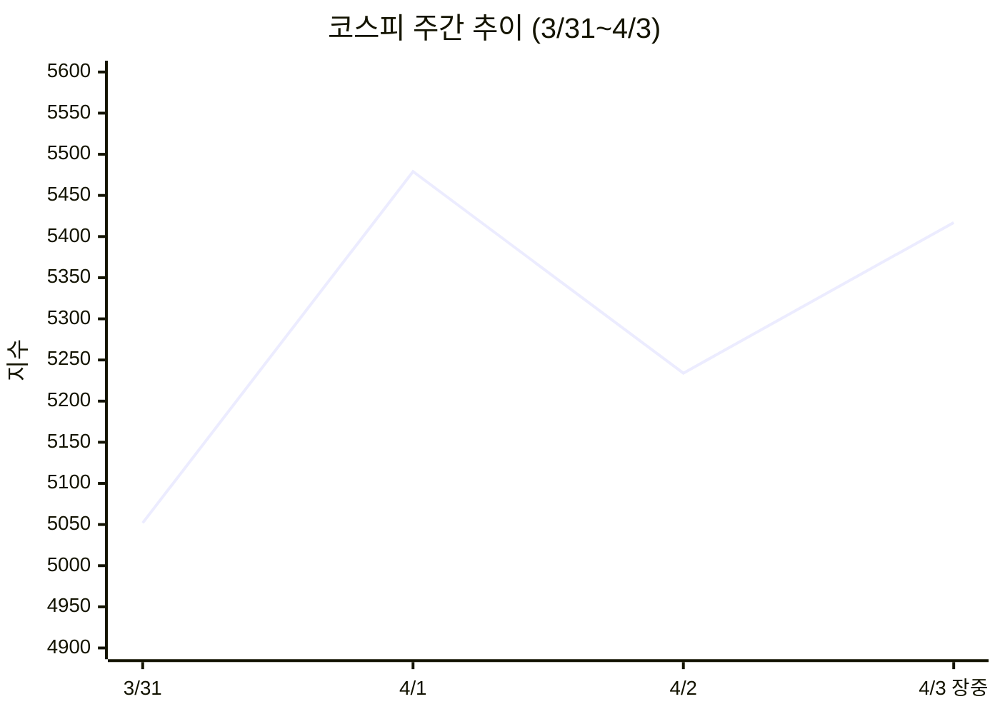
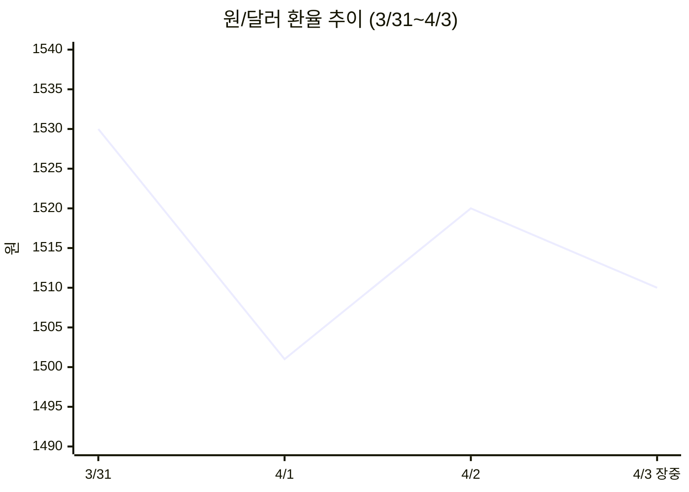
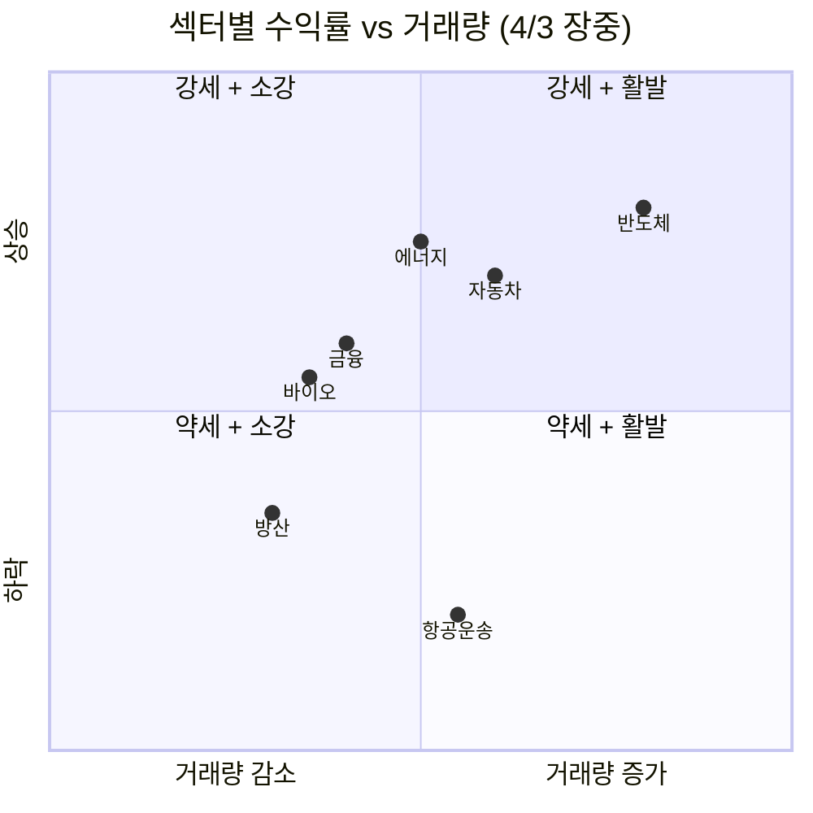

---

# 🐝 꿀벌 뉴스레터 [증시]: 종전 기대 꺾인 롤러코스터 장세, 5200~5500 박스권 등판 (2026-04-03)

코스피가 이틀 새 +8.44% → −4.47%를 오가는 극한 변동성을 보이고 있다. 트럼프 대통령의 이란 강경 연설이 종전 기대를 꺾었고, WGBI 편입 자금 유입이라는 호재와 호르무즈 해협 봉쇄 장기화라는 악재가 정면충돌하는 구간이다. 오늘 장중 3.5% 반등 출발했지만, 진짜 반등인지 데드캣 바운스인지 아직 판단이 이르다.

---

## 📉 증시 현황

- **핵심**: 코스피 4월 2일 **5,234.05** 마감(−4.47%), 양 시장 매도 사이드카 발동. 4월 3일 오전 **5,417**(+3.50%) 반등 출발 — 뉴욕 증시 반등 효과.
- **분석**: 4/1 종전 기대에 8.44% 급등한 코스피가 하루 만에 4.47% 반납. 트럼프 대통령이 "2~3주간 이란에 극도로 강력한 타격"을 예고하면서 장중 5,170까지 밀렸다. 코스닥도 −5.36% 급락, KOSDAQ150 선물 사이드카 발동.
- **전망**: **조건 A**(호르무즈 해협 부분 개방 + 휴전 협상 재개) → 5,500 돌파 후 안정화. **조건 B**(전쟁 2~3주 연장 + 유가 $120+ 돌파) → 5,000 하회 재차 테스트, 서킷브레이커 재발동 가능.

---

## 📊 이번 주 시장 흐름

---

## 💸 외국인 동향

**팩트** — 외국인은 3월 한 달간 국내 증시에서 약 **36조 원** 순매도. 삼성전자·SK하이닉스·현대차 등 시총 상위 종목에서만 5조 원 이상 매도. 4월 3일 오전에도 **998억 원** 순매도 진행 중(기관 1,967억 순매수 vs 개인·외국인 순매도).

**맥락** — 반등장에서도 외국인은 매도 기조를 유지하고 있다. 중동 지정학 리스크로 안전자산 선호가 극대화되면서 신흥국 자금 이탈이 가속화된 영향.

**영향** — 다만 WGBI 편입 효과로 채권 시장에는 4거래일(3/30~4/2) 만에 **4.7조 원** 외국인 순매수 유입. 일본 GPIF 등 대형 연기금 자금으로 추정. 주식과 채권 시장의 자금 흐름이 극명하게 갈리는 양상.

**전망** — **조건 A**(종전 시그널) → 외국인 주식 순매수 전환, 환율 하락 선순환. **조건 B**(전쟁 장기화) → 채권 유입은 지속되나 주식 매도 가속, 환율 1,550원 돌파 가능.

> 💡 **한 줄 인사이트**: 외국인의 "주식 팔고 채권 사기" 이중 전략은 WGBI 편입이라는 구조적 이벤트가 지정학 리스크를 일부 상쇄하고 있음을 보여준다.
> 🔗 [Seoul Economic Daily - WGBI 4.7조 유입](https://en.sedaily.com/finance/2026/04/03/foreign-investors-snap-up-47-trillion-won-in-korean-bonds) · [Korea Herald - WGBI 채권 매수](https://www.koreaherald.com/article/10708468) · [미주중앙일보 - 외국인 매도](https://www.koreadaily.com/article/20260402082930138)

---

## ⚡ 지정학 이슈

**팩트** — 트럼프 대통령은 4월 2일 백악관 연설에서 "앞으로 2~3주간 이란에 극도로 강력한 타격을 가하겠다"고 발언. 시장은 종전이 아닌 **확전** 시나리오로 기울었다. WTI 유가는 장중 6% 급등해 배럴당 **$107.80** 돌파.

**맥락** — 2월 28일 미-이스라엘 공습 시작 이후 35일째. 호르무즈 해협은 사상 첫 실전 봉쇄 상태로, 하루 약 2,000만 배럴의 원유 수송이 차질을 빚고 있다. CNBC에 따르면 "4월 중순까지 해협이 재개방되지 않으면 원유 공급 혼란이 급격히 악화될 것."

**영향** — 한국은 원유 수입의 대부분을 중동에 의존하며, LNG 가격은 전쟁 전 대비 **48% 상승**. 고유가→고환율→수입 물가 상승의 3중 충격이 스태그플레이션 우려로 이어지고 있다. 코스피는 전쟁 시작 이후 고점 대비 **16% 이상** 하락.

**전망** — **조건 A**(이란이 오만 중재로 호르무즈 해협 선박 통행 프로토콜 합의) → 유가 급락, 글로벌 리스크온 전환. **조건 B**(전쟁 2~3주 연장, 해협 봉쇄 지속) → WTI $120+ 돌파 시 글로벌 경기침체 본격 논의.

> 💡 **한 줄 인사이트**: 시장이 진정으로 회복하려면 트럼프의 입이 아니라 호르무즈 해협이 열려야 한다.
> 🔗 [CNBC - Hormuz 봉쇄 경고](https://www.cnbc.com/2026/03/28/oil-gas-prices-iran-war-hormuz.html) · [Wikipedia - 2026 이란 전쟁 경제적 영향](https://en.wikipedia.org/wiki/Economic_impact_of_the_2026_Iran_war) · [CSIS - 유가 급등 분석](https://www.csis.org/analysis/iran-conflict-sending-oil-prices-soaring-what-happens-next)

---

## 💱 환율·거시경제

**팩트** — 원/달러 환율은 4월 2일 장중 **1,524.10원**까지 터치한 뒤 마감 1,520원대. 3일 오전 1,510원대로 소폭 하락 출발. 3월 18일 처음 1,500원 돌파 후 한 달째 고환율 고착 상태.

**맥락** — WGBI 편입(4/1 발효)으로 채권 자금 유입이 원화 지지 역할을 하고 있으나, 지정학 불안에 따른 달러 강세 압력이 이를 상쇄. 한편 3월 수출은 전년 대비 **+48.3%** 증가한 **861억 달러**로 역대 최고치 — 반도체 수출 호조가 견인.

**영향** — 수출 실적은 견조하나 원화 약세로 수입 물가가 동반 상승하면서 기업 수익성과 소비자물가에 이중 부담. 정부가 WGBI 관련 외국자금 모니터링 전담 TF를 가동 중.

> 💡 **한 줄 인사이트**: 수출 역대 최고에도 환율이 1,500원을 유지하는 건, 지정학이 펀더멘털을 압도하는 전형적 '워 이코노미' 환경이다.
> 🔗 [더퍼블릭 - 환율 1500원](https://www.thepublic.kr/news/articleView.html?idxno=299765) · [나무위키 - 원화 고환율 사태](https://namu.wiki/w/2025-2026%EB%85%84%20%EC%9B%90%ED%99%94%20%EA%B3%A0%ED%99%98%EC%9C%A8%20%EC%82%AC%ED%83%9C) · [Korea.net - WGBI 편입](https://www.korea.net/NewsFocus/Business/view?articleId=290067)

---

## 📈 섹터 분화

**반도체 — 롤러코스터 진앙지**
삼성전자(−11.7%)·SK하이닉스(−9.6%)는 3월 초 폭락장의 핵심 타격 종목이었으나, 4/3 오전 SK하이닉스(+6.02%)·삼성전자(+4.76%)로 반등 주도. 월가 약세론자 코라노비치는 4/3 X(트위터)에서 "반도체 모멘텀주 아래 25% 에어포켓이 있다"고 추가 하락 경고.

**에너지 — 전쟁 수혜 섹터**
유가 $107+ 돌파에 에너지 관련주 강세 지속. 반면 항공·운송주는 원가 부담 급등으로 약세.

**방산 — 차익 실현 구간**
LIG넥스원 등 방산주는 전쟁 시작 이후 급등 뒤 4/3 장중 −1.91%로 차익 실현 매물 출회.

---

## 🗺️ 섹터 등락 히트맵

---

## 🎯 오늘의 핵심 시그널

> 이 세 가지를 기억하라.

1. **[호르무즈 타임리밋]**: 4월 중순까지 해협 미개방 시 원유 공급 위기 본격화 — 시장의 진짜 시한폭탄은 트럼프 입이 아니라 해협이다.
2. **[WGBI vs 전쟁]**: 채권 4.7조 유입 vs 주식 36조 유출. 구조적 호재와 지정학 악재의 줄다리기가 환율 1,500원대 고착으로 나타나고 있다.
3. **[변동성 정상화 착각 금지]**: 이틀간 +8%→−4%→+3%. 일중 변동폭 자체가 비정상적 — VIX 31 수준에서 방향 베팅은 도박이다.

---

## 📌 다음 주 주목할 변수

- **호르무즈 해협 프로토콜 협상**: 이란-오만 중재 결과에 따라 유가·환율·증시 방향성 일거에 결정
- **트럼프 대통령 추가 발언**: "2~3주 강력 타격" 발언의 구체적 행동 여부 — 확전 or 블러프
- **WGBI 2차 편입 자금 유입 규모**: 4월 중 추가 매수 물량이 원화 방어에 얼마나 기여하는지
- **외국인 주식시장 순매수 전환 여부**: 3월 36조 순매도 후 4월 첫 주 방향성 확인
- **WTI $110 돌파 지속 여부**: 유가가 $110 위에서 안착하면 스태그플레이션 논의 본격화

---

## 📎 출처

- [CNBC - 코스피 12% 폭락 (3/4)](https://www.cnbc.com/2026/03/04/asia-markets-hang-seng-index-kospi-nikkei-225.html)
- [CNBC - 호르무즈 해협 봉쇄와 유가](https://www.cnbc.com/2026/03/28/oil-gas-prices-iran-war-hormuz.html)
- [Seoul Economic Daily - WGBI 외국인 4.7조 채권 매수](https://en.sedaily.com/finance/2026/04/03/foreign-investors-snap-up-47-trillion-won-in-korean-bonds)
- [Seoul Economic Daily - 코라노비치 25% 추가 하락 경고](https://en.sedaily.com/finance/2026/04/03/25-percent-kospi-crash-is-coming-wall-street-bear-fumes-at)
- [헤럴드경제 - 트럼프 발언에 코스피 5500선 붕괴, 사이드카 발동](https://biz.heraldcorp.com/article/10700209)
- [헤럴드경제 - 종전 기대 꺾여 코스피 급락](https://biz.heraldcorp.com/article/10708824)
- [서울신문 - 멀어진 종전에 코스피 4% 급락 환율 18원 급등](https://www.seoul.co.kr/news/economy/securities/2026/04/03/20260403029003)
- [서울와이어 - 코스피 3%↑ 상승 출발](https://www.seoulwire.com/news/articleView.html?idxno=714974)
- [Korea Herald - 외국인 WGBI 채권 순매수](https://www.koreaherald.com/article/10708468)
- [TheStreet - S&P 500 April 2 마감](https://www.thestreet.com/latest-news/stock-market-today-apr-2-2026-updates)
- [CSIS - 이란 유가 분석](https://www.csis.org/analysis/iran-conflict-sending-oil-prices-soaring-what-happens-next)
- [Wikipedia - 2026 이란 전쟁 경제적 영향](https://en.wikipedia.org/wiki/Economic_impact_of_the_2026_Iran_war)
- [더퍼블릭 - 원달러 환율 1500원](https://www.thepublic.kr/news/articleView.html?idxno=299765)
- [Korea.net - WGBI 편입 확정](https://www.korea.net/NewsFocus/Business/view?articleId=290067)